# مخططات تصميم النظام — الفصل ٣

**٢٦ مخطط.** المصادر `.mmd` هي المرجع؛ الـ`.png` مولّدة منها، والوثيقة الرسمية
`docs/Sufria_Chapter3_System_Design_v1.0.docx` مبنية من الـ`.png`.

GitHub بيعرض Mermaid تلقائيا، فكل مخطط تحت بينعرض مباشرة بالمتصفح.

---

## 🔴 الـERD مولّد من قاعدة البيانات الحقيقية

مش مرسوم بالإيد. `scripts/generate-erd.mjs` بيقرأ `information_schema` وبيطلع المخطط.
**يعني مستحيل يناقض الـschema.** بعد أي migration:

```bash
export MIGRATION_DATABASE_URL="postgres://..."
node scripts/generate-erd.mjs > docs/diagrams/01-erd.mmd
```

## إعادة توليد الصور

```bash
npm i -g @mermaid-js/mermaid-cli
cd docs/diagrams
for f in *.mmd; do mmdc -i "$f" -o "${f%.mmd}.png" -b white -w 1500 -s 2; done
```

ثم أعد بناء الوثيقة: `node build-ch3.js`

---

## الفهرس

| الشكل | الملف | الموضوع |
|---|---|---|
| 3.1 | `02-context` | مخطط السياق (DFD مستوى ٠) |
| 3.2 | `03a-use-case-customer` | حالات استخدام الزبون |
| 3.3 | `03b-use-case-restaurant` | حالات استخدام المطعم |
| 3.4 | `03c-use-case-system` | حالات استخدام النظام (بلا فاعل بشري) |
| 3.5 | `04-component` | مخطط المكوّنات |
| 3.6 | `05-deployment` | مخطط النشر |
| **3.7** | **`01-erd`** | **ERD — مولّد من القاعدة** |
| 3.8 | `06a-class-auth` | صنفيات: سلسلة المصادقة والتفويض |
| 3.9 | `06b-class-orders` | صنفيات: الطلبات والحزمة المشتركة |
| 3.10 | `06c-class-conversation` | صنفيات: الـwebhook وتوجيه المحادثة |
| 3.11 | `06d-class-order-engine` | صنفيات: إنشاء الطلب والـschedulers |
| 3.12 | `07-state-order` | آلة حالات الطلب |
| 3.13 | `08-state-session` | آلة حالات الجلسة |
| 3.14-3.16 | `09a/b/c-activity-cash-*` | نشاط: طلب كاش (٣ أجزاء) |
| 3.17-3.18 | `10a/b-activity-status-*` | نشاط: تحديث الحالة (جزءين) |
| 3.19 | `14-seq-webhook-gate` | تسلسل: بوابة الـwebhook |
| 3.20 | `12-seq-cash-order` | تسلسل: إنشاء طلب كاش |
| 3.21 | `13-seq-online-payment` | تسلسل: الدفع الإلكتروني |
| 3.22 | `15-seq-status-update` | تسلسل: تحديث الحالة والمهام المجدولة |
| 3.23 | `16-seq-proactive-reorder` | تسلسل: إعادة الطلب الاستباقية (FR-08) |
| 3.24 | `17-seq-payment-timeout` | تسلسل: مهلة الدفع والتحوّل للكاش |
| 3.25 | `18-seq-concurrent-cancel` | تسلسل: سباق الإلغاء مقابل الدفع |
| 3.26 | `11-dfd-level1` | DFD مستوى ١ |

---

## الشكل 3.1 — `02-context`

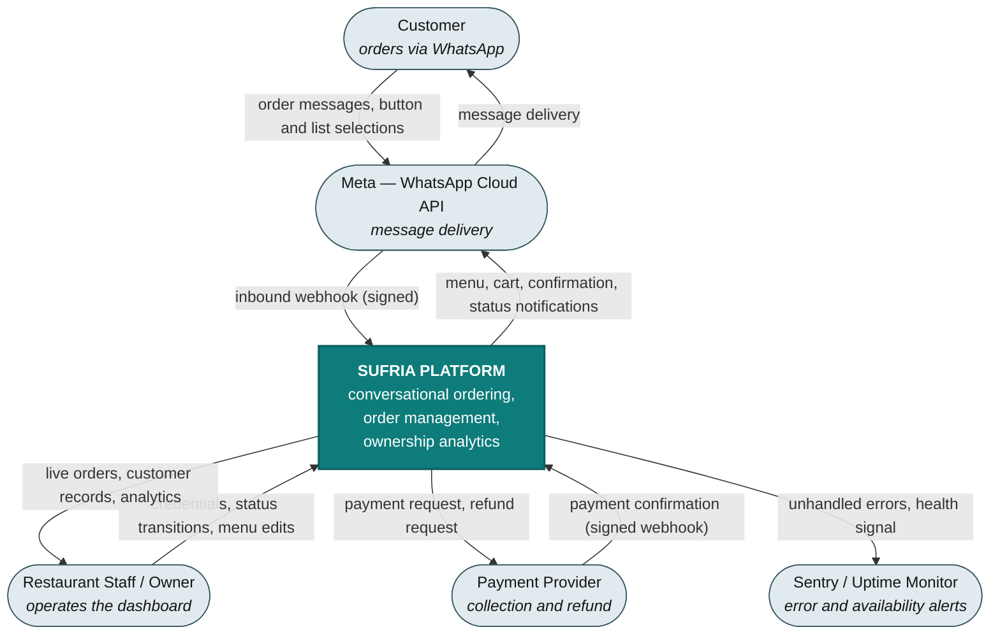
```mermaid
flowchart TB
    classDef ext fill:#E1EAEE,stroke:#35555F,stroke-width:1px,color:#161615
    classDef sys fill:#0E7C7B,stroke:#0A5F5E,stroke-width:2px,color:#FFFFFF
    classDef store fill:#EDE6F7,stroke:#5B3A99,color:#161615

    CUST(["Customer<br/><i>orders via WhatsApp</i>"]):::ext
    STAFF(["Restaurant Staff / Owner<br/><i>operates the dashboard</i>"]):::ext
    META(["Meta — WhatsApp Cloud API<br/><i>message delivery</i>"]):::ext
    PAY(["Payment Provider<br/><i>collection and refund</i>"]):::ext
    MON(["Sentry / Uptime Monitor<br/><i>error and availability alerts</i>"]):::ext

    SUFRIA["<b>SUFRIA PLATFORM</b><br/>conversational ordering,<br/>order management,<br/>ownership analytics"]:::sys

    CUST -- "order messages, button and list selections" --> META
    META -- "inbound webhook (signed)" --> SUFRIA
    SUFRIA -- "menu, cart, confirmation, status notifications" --> META
    META -- "message delivery" --> CUST

    STAFF -- "credentials, status transitions, menu edits" --> SUFRIA
    SUFRIA -- "live orders, customer records, analytics" --> STAFF

    SUFRIA -- "payment request, refund request" --> PAY
    PAY -- "payment confirmation (signed webhook)" --> SUFRIA

    SUFRIA -- "unhandled errors, health signal" --> MON
```

## الشكل 3.2 — `03a-use-case-customer`

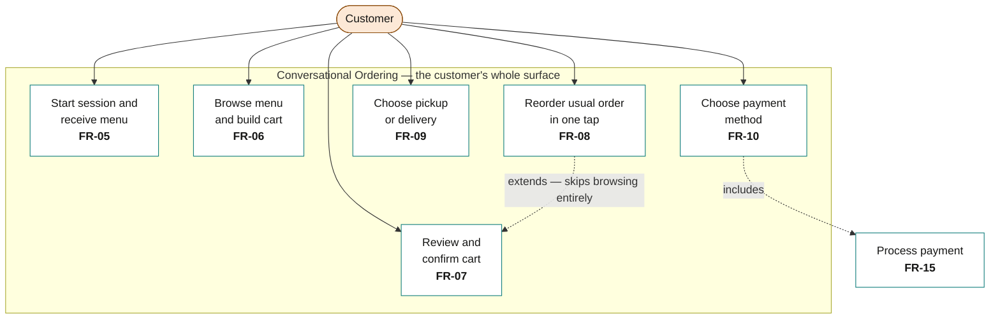
```mermaid
flowchart TB
    classDef actor fill:#FCE8D6,stroke:#8A4A0A,stroke-width:1px,color:#161615
    classDef uc fill:#FFFFFF,stroke:#0E7C7B,stroke-width:1px,color:#161615

    C(["Customer"]):::actor

    subgraph ORDERING["Conversational Ordering — the customer's whole surface"]
        direction LR
        U5["Start session and<br/>receive menu<br/><b>FR-05</b>"]:::uc
        U6["Browse menu<br/>and build cart<br/><b>FR-06</b>"]:::uc
        U7["Review and<br/>confirm cart<br/><b>FR-07</b>"]:::uc
        U8["Reorder usual order<br/>in one tap<br/><b>FR-08</b>"]:::uc
        U9["Choose pickup<br/>or delivery<br/><b>FR-09</b>"]:::uc
        U10["Choose payment<br/>method<br/><b>FR-10</b>"]:::uc
    end

    C --> U5
    C --> U6
    C --> U7
    C --> U8
    C --> U9
    C --> U10
    U8 -. "extends — skips browsing entirely" .-> U7
    U10 -. "includes" .-> U15["Process payment<br/><b>FR-15</b>"]:::uc
```

## الشكل 3.3 — `03b-use-case-restaurant`

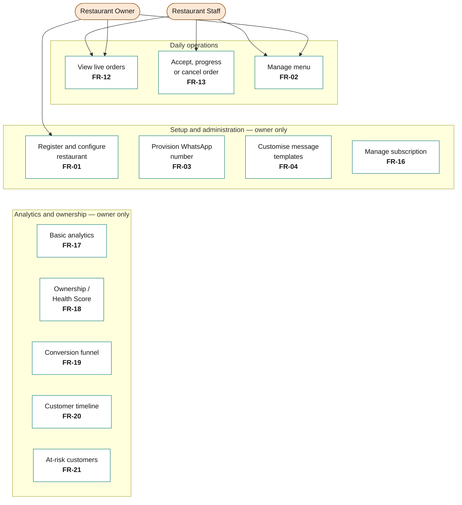
```mermaid
flowchart TB
    classDef actor fill:#FCE8D6,stroke:#8A4A0A,stroke-width:1px,color:#161615
    classDef uc fill:#FFFFFF,stroke:#0E7C7B,stroke-width:1px,color:#161615

    S(["Restaurant Staff"]):::actor
    O(["Restaurant Owner"]):::actor

    subgraph OPS["Daily operations"]
        U12["View live orders<br/><b>FR-12</b>"]:::uc
        U13["Accept, progress<br/>or cancel order<br/><b>FR-13</b>"]:::uc
        U2["Manage menu<br/><b>FR-02</b>"]:::uc
    end

    subgraph SETUP["Setup and administration — owner only"]
        U1["Register and configure<br/>restaurant<br/><b>FR-01</b>"]:::uc
        U3["Provision WhatsApp<br/>number<br/><b>FR-03</b>"]:::uc
        U4["Customise message<br/>templates<br/><b>FR-04</b>"]:::uc
        U16["Manage subscription<br/><b>FR-16</b>"]:::uc
    end

    subgraph ANALYTICS["Analytics and ownership — owner only"]
        U17["Basic analytics<br/><b>FR-17</b>"]:::uc
        U18["Ownership /<br/>Health Score<br/><b>FR-18</b>"]:::uc
        U19["Conversion funnel<br/><b>FR-19</b>"]:::uc
        U20["Customer timeline<br/><b>FR-20</b>"]:::uc
        U21["At-risk customers<br/><b>FR-21</b>"]:::uc
    end

    S --> U12
    S --> U13
    S --> U2
    O --> U12
    O --> U2
    O --> U1
    OPS ~~~ SETUP
    SETUP ~~~ ANALYTICS
```

## الشكل 3.4 — `03c-use-case-system`

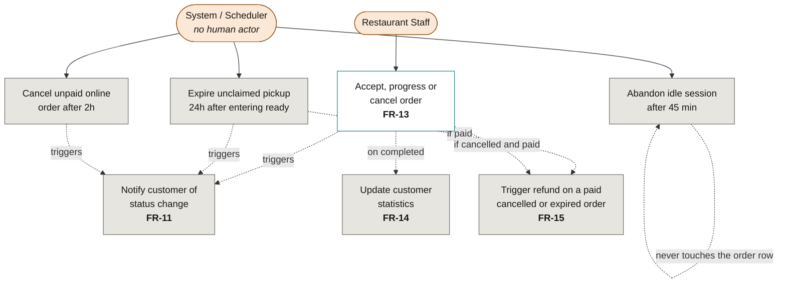
```mermaid
flowchart TB
    classDef actor fill:#FCE8D6,stroke:#8A4A0A,stroke-width:1px,color:#161615
    classDef sysuc fill:#E7E5E0,stroke:#6B6963,stroke-width:1px,color:#161615
    classDef uc fill:#FFFFFF,stroke:#0E7C7B,color:#161615

    SYS(["System / Scheduler<br/><i>no human actor</i>"]):::actor
    STAFF(["Restaurant Staff"]):::actor

    U13["Accept, progress or<br/>cancel order<br/><b>FR-13</b>"]:::uc
    U11["Notify customer of<br/>status change<br/><b>FR-11</b>"]:::sysuc
    U14["Update customer<br/>statistics<br/><b>FR-14</b>"]:::sysuc
    UT1["Expire unclaimed pickup<br/>24h after entering ready"]:::sysuc
    UT2["Cancel unpaid online<br/>order after 2h"]:::sysuc
    UT3["Abandon idle session<br/>after 45 min"]:::sysuc
    U15["Trigger refund on a paid<br/>cancelled or expired order<br/><b>FR-15</b>"]:::sysuc

    STAFF --> U13
    SYS --> UT1
    SYS --> UT2
    SYS --> UT3
    U13 -. "triggers" .-> U11
    U13 -. "on completed" .-> U14
    UT1 -. "triggers" .-> U11
    UT2 -. "triggers" .-> U11
    UT1 -. "if paid" .-> U15
    U13 -. "if cancelled and paid" .-> U15
    UT3 -. "never touches the order row" .-> UT3
```

## الشكل 3.5 — `04-component`

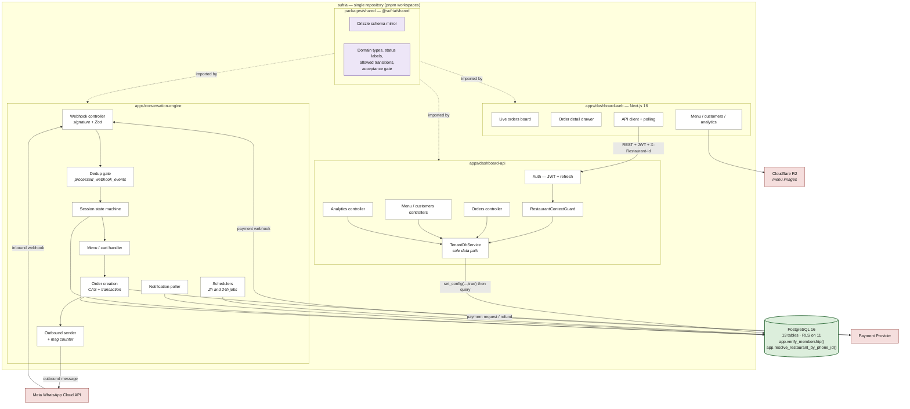
```mermaid
flowchart TB
    classDef svc fill:#E1EAEE,stroke:#35555F,stroke-width:2px,color:#161615
    classDef mod fill:#FFFFFF,stroke:#8A8A85,color:#161615
    classDef shared fill:#EDE6F7,stroke:#5B3A99,color:#161615
    classDef db fill:#DCEEDC,stroke:#24632F,stroke-width:2px,color:#161615
    classDef ext fill:#F5DEDD,stroke:#8A332F,color:#161615

    subgraph REPO["sufria — single repository (pnpm workspaces)"]
        direction TB

        subgraph WEB["apps/dashboard-web — Next.js 16"]
            W1["Live orders board"]:::mod
            W2["Order detail drawer"]:::mod
            W3["Menu / customers / analytics"]:::mod
            W4["API client + polling"]:::mod
        end

        subgraph SHARED["packages/shared — @sufria/shared"]
            SH1["Drizzle schema mirror"]:::shared
            SH2["Domain types, status labels,<br/>allowed transitions,<br/>acceptance gate"]:::shared
        end

        subgraph ENGINE["apps/conversation-engine"]
            E1["Webhook controller<br/><i>signature + Zod</i>"]:::mod
            E2["Dedup gate<br/><i>processed_webhook_events</i>"]:::mod
            E3["Session state machine"]:::mod
            E4["Menu / cart handler"]:::mod
            E5["Order creation<br/><i>CAS + transaction</i>"]:::mod
            E6["Outbound sender<br/><i>+ msg counter</i>"]:::mod
            E7["Schedulers<br/><i>2h and 24h jobs</i>"]:::mod
            E8["Notification poller"]:::mod
        end

        subgraph API["apps/dashboard-api"]
            A1["Auth — JWT + refresh"]:::mod
            A2["RestaurantContextGuard"]:::mod
            A3["TenantDbService<br/><i>sole data path</i>"]:::mod
            A4["Orders controller"]:::mod
            A5["Menu / customers controllers"]:::mod
            A6["Analytics controller"]:::mod
        end
    end

    DB[("PostgreSQL 16<br/>13 tables · RLS on 11<br/>app.verify_membership()<br/>app.resolve_restaurant_by_phone_id()")]:::db
    META["Meta WhatsApp Cloud API"]:::ext
    PAY["Payment Provider"]:::ext
    R2["Cloudflare R2<br/><i>menu images</i>"]:::ext

    W4 -->|"REST + JWT + X-Restaurant-Id"| A1
    A1 --> A2 --> A3
    A4 & A5 & A6 --> A3
    A3 -->|"set_config(...,true) then query"| DB

    META -->|"inbound webhook"| E1
    E1 --> E2 --> E3
    E3 --> E4 --> E5
    E5 --> E6 -->|"outbound message"| META
    E7 --> DB
    E8 --> DB
    E3 --> DB
    E5 --> DB
    PAY -->|"payment webhook"| E1
    E5 -->|"payment request / refund"| PAY
    W3 --> R2

    SHARED -.->|"imported by"| ENGINE
    SHARED -.->|"imported by"| API
    SHARED -.->|"imported by"| WEB
```

## الشكل 3.6 — `05-deployment`

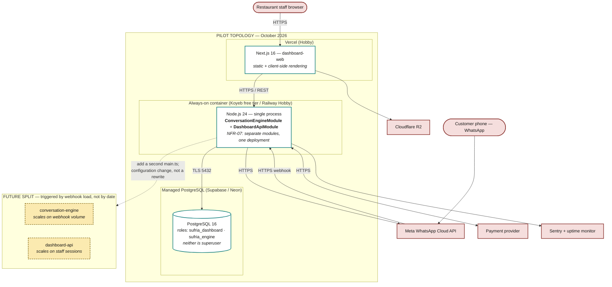
```mermaid
flowchart TB
    classDef node fill:#E1EAEE,stroke:#35555F,stroke-width:2px,color:#161615
    classDef proc fill:#FFFFFF,stroke:#0E7C7B,color:#161615
    classDef ext fill:#F5DEDD,stroke:#8A332F,color:#161615
    classDef future fill:#FBEAB0,stroke:#7A5C06,stroke-dasharray:4 3,color:#161615

    subgraph PILOT["PILOT TOPOLOGY — October 2026"]
        direction TB
        subgraph N1["Always-on container (Koyeb free tier / Railway Hobby)"]
            P1["Node.js 24 — single process<br/><b>ConversationEngineModule</b> + <b>DashboardApiModule</b><br/><i>NFR-07: separate modules, one deployment</i>"]:::proc
        end
        subgraph N2["Vercel (Hobby)"]
            P2["Next.js 16 — dashboard-web<br/><i>static + client-side rendering</i>"]:::proc
        end
        subgraph N3["Managed PostgreSQL (Supabase / Neon)"]
            P3[("PostgreSQL 16<br/>roles: sufria_dashboard · sufria_engine<br/><i>neither is superuser</i>")]:::proc
        end
    end

    BROWSER(["Restaurant staff browser"]):::ext
    PHONE(["Customer phone — WhatsApp"]):::ext
    META["Meta WhatsApp Cloud API"]:::ext
    PAYG["Payment provider"]:::ext
    R2["Cloudflare R2"]:::ext
    SENTRY["Sentry + uptime monitor"]:::ext

    BROWSER -->|"HTTPS"| P2
    P2 -->|"HTTPS / REST"| P1
    PHONE --> META
    META -->|"HTTPS webhook"| P1
    P1 -->|"HTTPS"| META
    P1 <-->|"HTTPS"| PAYG
    P1 -->|"TLS 5432"| P3
    P2 --> R2
    P1 --> SENTRY

    subgraph LATER["FUTURE SPLIT — triggered by webhook load, not by date"]
        direction LR
        F1["conversation-engine<br/><i>scales on webhook volume</i>"]:::future
        F2["dashboard-api<br/><i>scales on staff sessions</i>"]:::future
    end
    P1 -.->|"add a second main.ts;<br/>configuration change, not a rewrite"| LATER
```

## الشكل 3.7 — `01-erd`

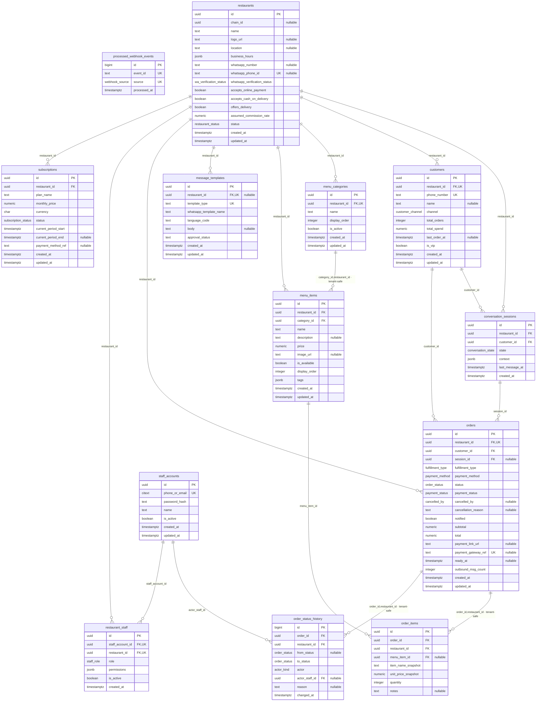
```mermaid
erDiagram
  conversation_sessions {
    uuid id PK
    uuid restaurant_id FK
    uuid customer_id FK
    conversation_state state
    jsonb context
    timestamptz last_message_at
    timestamptz created_at
  }
  customers {
    uuid id PK
    uuid restaurant_id FK,UK
    text phone_number UK
    text name "nullable"
    customer_channel channel
    integer total_orders
    numeric total_spend
    timestamptz last_order_at "nullable"
    boolean is_vip
    timestamptz created_at
    timestamptz updated_at
  }
  menu_categories {
    uuid id PK
    uuid restaurant_id FK,UK
    text name
    integer display_order
    boolean is_active
    timestamptz created_at
    timestamptz updated_at
  }
  menu_items {
    uuid id PK
    uuid restaurant_id FK
    uuid category_id FK
    text name
    text description "nullable"
    numeric price
    text image_url "nullable"
    boolean is_available
    integer display_order
    jsonb tags
    timestamptz created_at
    timestamptz updated_at
  }
  message_templates {
    uuid id PK
    uuid restaurant_id FK,UK "nullable"
    text template_type UK
    text whatsapp_template_name
    text language_code
    text body "nullable"
    text approval_status
    timestamptz created_at
    timestamptz updated_at
  }
  order_items {
    uuid id PK
    uuid order_id FK
    uuid restaurant_id FK
    uuid menu_item_id FK "nullable"
    text item_name_snapshot
    numeric unit_price_snapshot
    integer quantity
    text notes "nullable"
  }
  order_status_history {
    bigint id PK
    uuid order_id FK
    uuid restaurant_id FK
    order_status from_status "nullable"
    order_status to_status
    actor_kind actor
    uuid actor_staff_id FK "nullable"
    text reason "nullable"
    timestamptz changed_at
  }
  orders {
    uuid id PK
    uuid restaurant_id FK,UK
    uuid customer_id FK
    uuid session_id FK "nullable"
    fulfillment_type fulfillment_type
    payment_method payment_method
    order_status status
    payment_status payment_status
    cancelled_by cancelled_by "nullable"
    text cancellation_reason "nullable"
    boolean notified
    numeric subtotal
    numeric total
    text payment_link_url "nullable"
    text payment_gateway_ref UK "nullable"
    timestamptz ready_at "nullable"
    integer outbound_msg_count
    timestamptz created_at
    timestamptz updated_at
  }
  processed_webhook_events {
    bigint id PK
    text event_id UK
    webhook_source source UK
    timestamptz processed_at
  }
  restaurant_staff {
    uuid id PK
    uuid staff_account_id FK,UK
    uuid restaurant_id FK,UK
    staff_role role
    jsonb permissions
    boolean is_active
    timestamptz created_at
  }
  restaurants {
    uuid id PK
    uuid chain_id "nullable"
    text name
    text logo_url "nullable"
    text location "nullable"
    jsonb business_hours
    text whatsapp_number "nullable"
    text whatsapp_phone_id UK "nullable"
    wa_verification_status whatsapp_verification_status
    boolean accepts_online_payment
    boolean accepts_cash_on_delivery
    boolean offers_delivery
    numeric assumed_commission_rate
    restaurant_status status
    timestamptz created_at
    timestamptz updated_at
  }
  staff_accounts {
    uuid id PK
    citext phone_or_email UK
    text password_hash
    text name
    boolean is_active
    timestamptz created_at
    timestamptz updated_at
  }
  subscriptions {
    uuid id PK
    uuid restaurant_id FK
    text plan_name
    numeric monthly_price
    char currency
    subscription_status status
    timestamptz current_period_start
    timestamptz current_period_end "nullable"
    text payment_method_ref "nullable"
    timestamptz created_at
    timestamptz updated_at
  }
  customers ||--o{ conversation_sessions : "customer_id"
  restaurants ||--o{ conversation_sessions : "restaurant_id"
  restaurants ||--o{ customers : "restaurant_id"
  restaurants ||--o{ menu_categories : "restaurant_id"
  menu_categories ||--o{ menu_items : "category_id,restaurant_id · tenant-safe"
  restaurants ||--o{ menu_items : "restaurant_id"
  restaurants ||--o{ message_templates : "restaurant_id"
  menu_items ||--o{ order_items : "menu_item_id"
  orders ||--o{ order_items : "order_id,restaurant_id · tenant-safe"
  staff_accounts ||--o{ order_status_history : "actor_staff_id"
  orders ||--o{ order_status_history : "order_id,restaurant_id · tenant-safe"
  customers ||--o{ orders : "customer_id"
  restaurants ||--o{ orders : "restaurant_id"
  conversation_sessions ||--o{ orders : "session_id"
  restaurants ||--o{ restaurant_staff : "restaurant_id"
  staff_accounts ||--o{ restaurant_staff : "staff_account_id"
  restaurants ||--o{ subscriptions : "restaurant_id"
```

## الشكل 3.8 — `06a-class-auth`

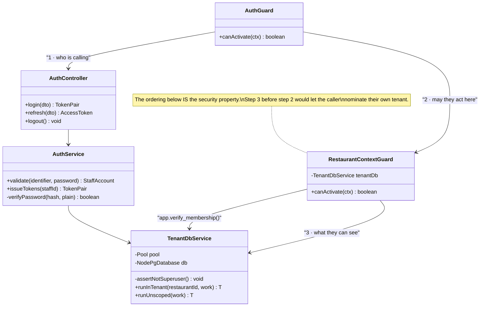
```mermaid
classDiagram
    direction TB
    note for RestaurantContextGuard "The ordering below IS the security property.\nStep 3 before step 2 would let the caller\nnominate their own tenant."

    class AuthController {
        +login(dto) TokenPair
        +refresh(dto) AccessToken
        +logout() void
    }
    class AuthService {
        +validate(identifier, password) StaffAccount
        +issueTokens(staffId) TokenPair
        -verifyPassword(hash, plain) boolean
    }
    class AuthGuard {
        +canActivate(ctx) boolean
    }
    class RestaurantContextGuard {
        -TenantDbService tenantDb
        +canActivate(ctx) boolean
    }
    class TenantDbService {
        -Pool pool
        -NodePgDatabase db
        -assertNotSuperuser() void
        +runInTenant(restaurantId, work) T
        +runUnscoped(work) T
    }

    AuthController --> AuthService
    AuthService --> TenantDbService
    AuthGuard --> AuthController : "1 · who is calling"
    AuthGuard --> RestaurantContextGuard : "2 · may they act here"
    RestaurantContextGuard --> TenantDbService : "app.verify_membership()"
    RestaurantContextGuard --> TenantDbService : "3 · what they can see"
```

## الشكل 3.9 — `06b-class-orders`

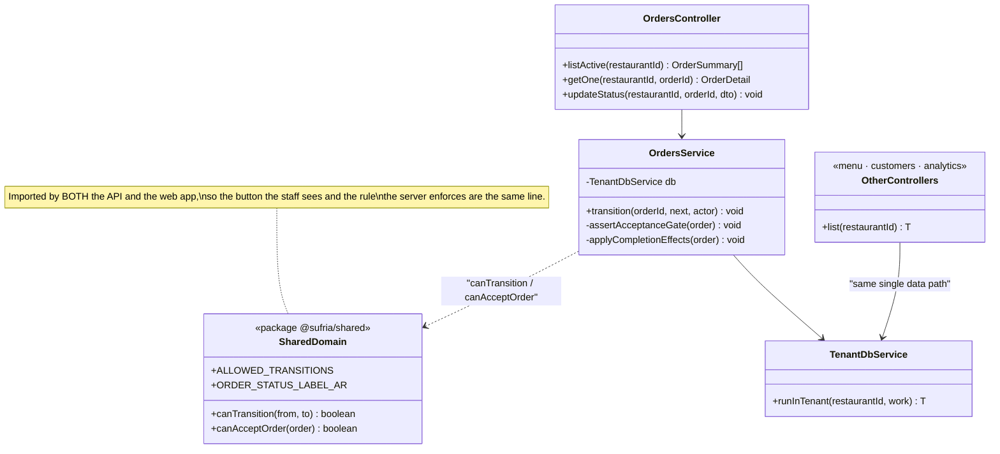
```mermaid
classDiagram
    direction TB
    note for SharedDomain "Imported by BOTH the API and the web app,\nso the button the staff sees and the rule\nthe server enforces are the same line."

    class OrdersController {
        +listActive(restaurantId) OrderSummary[]
        +getOne(restaurantId, orderId) OrderDetail
        +updateStatus(restaurantId, orderId, dto) void
    }
    class OrdersService {
        -TenantDbService db
        +transition(orderId, next, actor) void
        -assertAcceptanceGate(order) void
        -applyCompletionEffects(order) void
    }
    class SharedDomain {
        <<package @sufria/shared>>
        +ALLOWED_TRANSITIONS
        +canTransition(from, to) boolean
        +canAcceptOrder(order) boolean
        +ORDER_STATUS_LABEL_AR
    }
    class TenantDbService {
        +runInTenant(restaurantId, work) T
    }
    class OtherControllers {
        <<menu · customers · analytics>>
        +list(restaurantId) T
    }

    OrdersController --> OrdersService
    OrdersService ..> SharedDomain : "canTransition / canAcceptOrder"
    OrdersService --> TenantDbService
    OtherControllers --> TenantDbService : "same single data path"
```

## الشكل 3.10 — `06c-class-conversation`

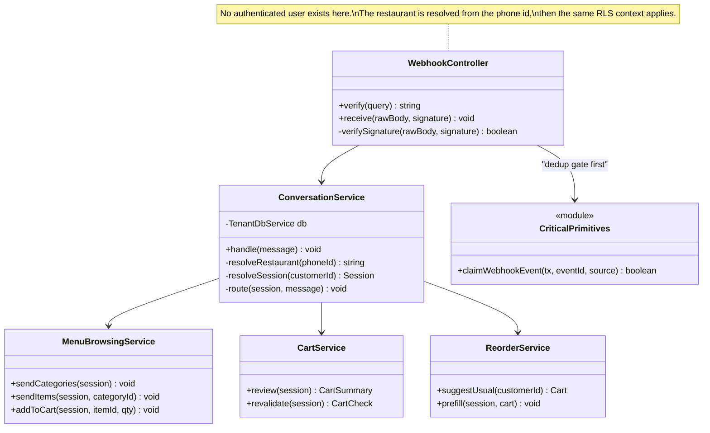
```mermaid
classDiagram
    direction TB
    note for WebhookController "No authenticated user exists here.\nThe restaurant is resolved from the phone id,\nthen the same RLS context applies."

    class WebhookController {
        +verify(query) string
        +receive(rawBody, signature) void
        -verifySignature(rawBody, signature) boolean
    }
    class ConversationService {
        -TenantDbService db
        +handle(message) void
        -resolveRestaurant(phoneId) string
        -resolveSession(customerId) Session
        -route(session, message) void
    }
    class MenuBrowsingService {
        +sendCategories(session) void
        +sendItems(session, categoryId) void
        +addToCart(session, itemId, qty) void
    }
    class CartService {
        +review(session) CartSummary
        +revalidate(session) CartCheck
    }
    class ReorderService {
        +suggestUsual(customerId) Cart
        +prefill(session, cart) void
    }
    class CriticalPrimitives {
        <<module>>
        +claimWebhookEvent(tx, eventId, source) boolean
    }

    WebhookController --> CriticalPrimitives : "dedup gate first"
    WebhookController --> ConversationService
    ConversationService --> MenuBrowsingService
    ConversationService --> CartService
    ConversationService --> ReorderService
```

## الشكل 3.11 — `06d-class-order-engine`

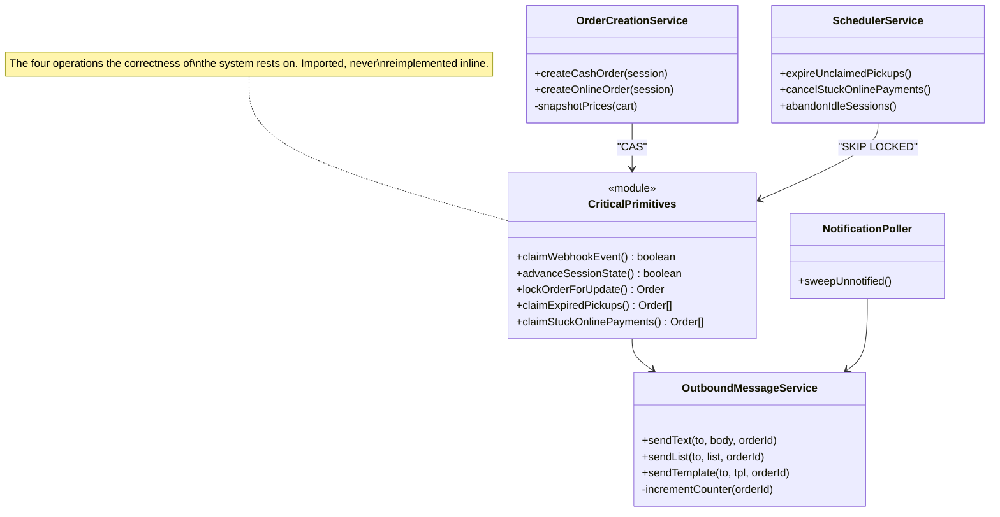
```mermaid
classDiagram
    direction TB
    note for CriticalPrimitives "The four operations the correctness of\nthe system rests on. Imported, never\nreimplemented inline."

    class OrderCreationService {
        +createCashOrder(session)
        +createOnlineOrder(session)
        -snapshotPrices(cart)
    }
    class SchedulerService {
        +expireUnclaimedPickups()
        +cancelStuckOnlinePayments()
        +abandonIdleSessions()
    }
    class CriticalPrimitives {
        <<module>>
        +claimWebhookEvent() boolean
        +advanceSessionState() boolean
        +lockOrderForUpdate() Order
        +claimExpiredPickups() Order[]
        +claimStuckOnlinePayments() Order[]
    }
    class OutboundMessageService {
        +sendText(to, body, orderId)
        +sendList(to, list, orderId)
        +sendTemplate(to, tpl, orderId)
        -incrementCounter(orderId)
    }
    class NotificationPoller {
        +sweepUnnotified()
    }

    OrderCreationService --> CriticalPrimitives : "CAS"
    SchedulerService --> CriticalPrimitives : "SKIP LOCKED"
    CriticalPrimitives --> OutboundMessageService
    NotificationPoller --> OutboundMessageService
```

## الشكل 3.12 — `07-state-order`

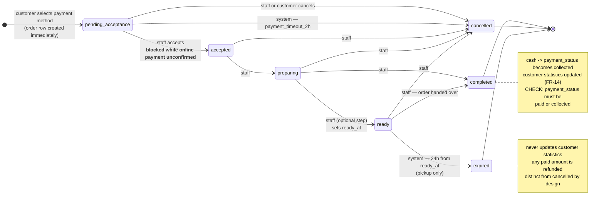
```mermaid
stateDiagram-v2
    direction LR
    [*] --> pending_acceptance : customer selects payment method<br/>(order row created immediately)

    pending_acceptance --> accepted : staff accepts<br/><b>blocked while online payment unconfirmed</b>
    pending_acceptance --> cancelled : staff or customer cancels
    pending_acceptance --> cancelled : system — payment_timeout_2h

    accepted --> preparing : staff
    accepted --> cancelled : staff

    preparing --> ready : staff (optional step)<br/>sets ready_at
    preparing --> completed : staff
    preparing --> cancelled : staff

    ready --> completed : staff — order handed over
    ready --> cancelled : staff
    ready --> expired : system — 24h from ready_at<br/>(pickup only)

    completed --> [*]
    cancelled --> [*]
    expired --> [*]

    note right of completed
        cash -> payment_status becomes collected
        customer statistics updated (FR-14)
        CHECK: payment_status must be
        paid or collected
    end note

    note right of expired
        never updates customer statistics
        any paid amount is refunded
        distinct from cancelled by design
    end note
```

## الشكل 3.13 — `08-state-session`

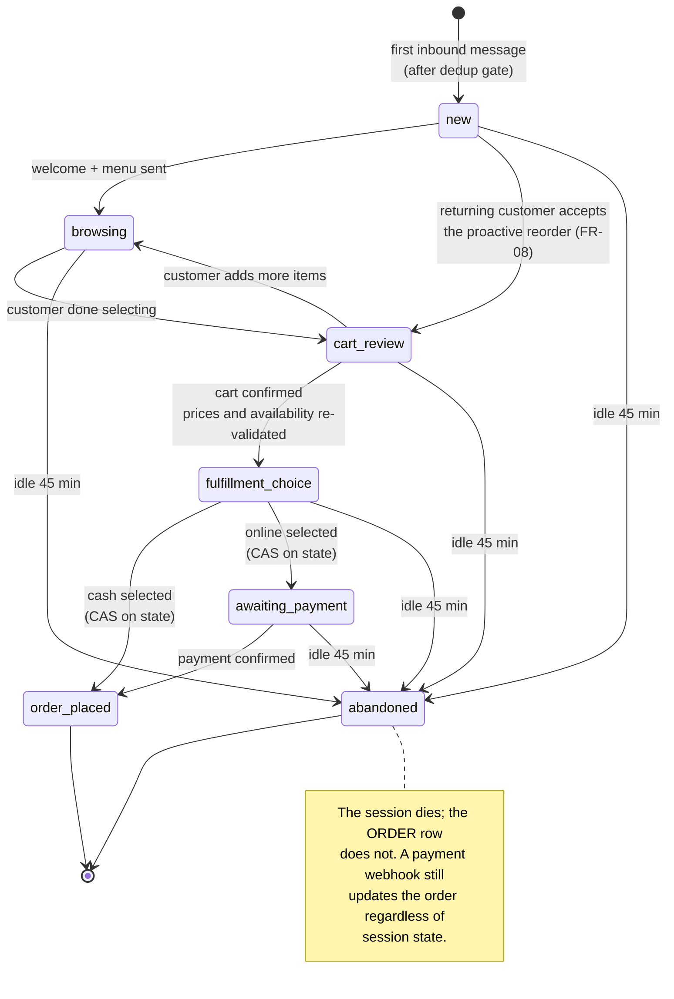
```mermaid
stateDiagram-v2
    direction TB
    [*] --> new : first inbound message<br/>(after dedup gate)

    new --> browsing : welcome + menu sent
    new --> cart_review : returning customer accepts<br/>the proactive reorder (FR-08)

    browsing --> cart_review : customer done selecting
    cart_review --> browsing : customer adds more items
    cart_review --> fulfillment_choice : cart confirmed<br/>prices and availability re-validated

    fulfillment_choice --> order_placed : cash selected<br/>(CAS on state)
    fulfillment_choice --> awaiting_payment : online selected<br/>(CAS on state)
    awaiting_payment --> order_placed : payment confirmed

    new --> abandoned : idle 45 min
    browsing --> abandoned : idle 45 min
    cart_review --> abandoned : idle 45 min
    fulfillment_choice --> abandoned : idle 45 min
    awaiting_payment --> abandoned : idle 45 min

    order_placed --> [*]
    abandoned --> [*]

    note right of abandoned
        The session dies; the ORDER row
        does not. A payment webhook still
        updates the order regardless of
        session state.
    end note
```

## الشكل 3.14 — `09a-activity-cash-intake`

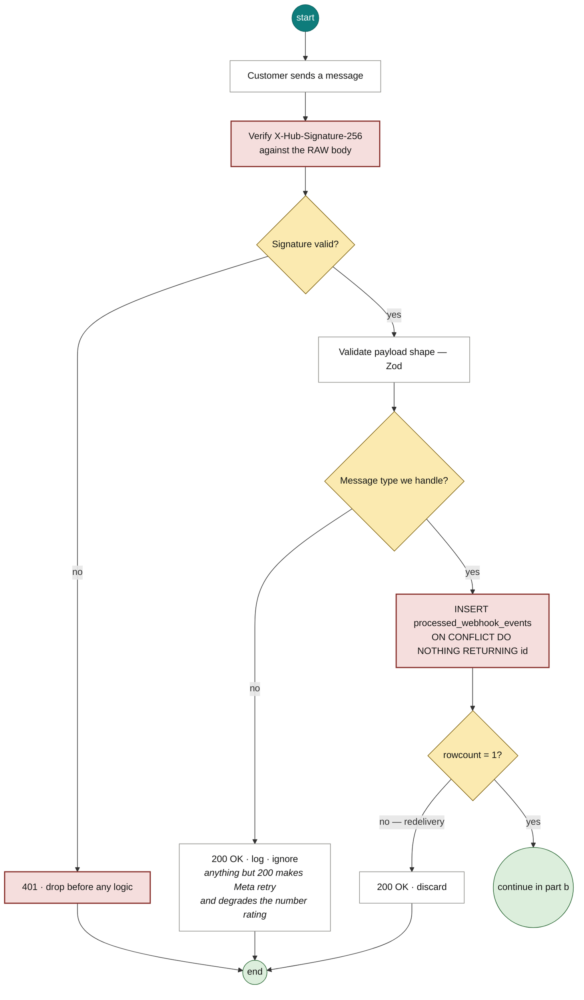
```mermaid
flowchart TB
    classDef start fill:#0E7C7B,stroke:#0A5F5E,color:#FFFFFF
    classDef act fill:#FFFFFF,stroke:#8A8A85,color:#161615
    classDef dec fill:#FBEAB0,stroke:#7A5C06,color:#161615
    classDef crit fill:#F5DEDD,stroke:#8A332F,stroke-width:2px,color:#161615
    classDef fin fill:#DCEEDC,stroke:#24632F,color:#161615

    S(("start")):::start --> A1["Customer sends a message"]:::act
    A1 --> A2["Verify X-Hub-Signature-256<br/>against the RAW body"]:::crit
    A2 --> D1{"Signature valid?"}:::dec
    D1 -- no --> E1["401 · drop before any logic"]:::crit --> F1(("end")):::fin
    D1 -- yes --> A3["Validate payload shape — Zod"]:::act
    A3 --> D2{"Message type we handle?"}:::dec
    D2 -- no --> E2["200 OK · log · ignore<br/><i>anything but 200 makes Meta retry<br/>and degrades the number rating</i>"]:::act --> F1
    D2 -- yes --> A4["INSERT processed_webhook_events<br/>ON CONFLICT DO NOTHING RETURNING id"]:::crit
    A4 --> D3{"rowcount = 1?"}:::dec
    D3 -- "no — redelivery" --> E3["200 OK · discard"]:::act --> F1
    D3 -- yes --> F2(("continue in part b")):::fin
```

## الشكل 3.15 — `09b-activity-cash-route`

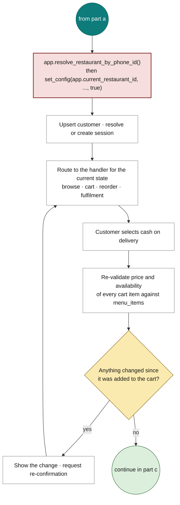
```mermaid
flowchart TB
    classDef start fill:#0E7C7B,stroke:#0A5F5E,color:#FFFFFF
    classDef act fill:#FFFFFF,stroke:#8A8A85,color:#161615
    classDef dec fill:#FBEAB0,stroke:#7A5C06,color:#161615
    classDef crit fill:#F5DEDD,stroke:#8A332F,stroke-width:2px,color:#161615
    classDef fin fill:#DCEEDC,stroke:#24632F,color:#161615

    S(("from part a")):::start --> A5["app.resolve_restaurant_by_phone_id()<br/>then set_config(app.current_restaurant_id, ..., true)"]:::crit
    A5 --> A6["Upsert customer · resolve or create session"]:::act
    A6 --> A7["Route to the handler for the current state<br/>browse · cart · reorder · fulfilment"]:::act
    A7 --> A8["Customer selects cash on delivery"]:::act
    A8 --> A9["Re-validate price and availability<br/>of every cart item against menu_items"]:::act
    A9 --> D4{"Anything changed since<br/>it was added to the cart?"}:::dec
    D4 -- yes --> E4["Show the change · request re-confirmation"]:::act --> A7
    D4 -- no --> F2(("continue in part c")):::fin
```

## الشكل 3.16 — `09c-activity-cash-commit`

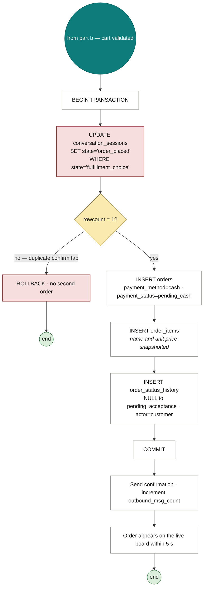
```mermaid
flowchart TB
    classDef start fill:#0E7C7B,stroke:#0A5F5E,color:#FFFFFF
    classDef act fill:#FFFFFF,stroke:#8A8A85,color:#161615
    classDef dec fill:#FBEAB0,stroke:#7A5C06,color:#161615
    classDef crit fill:#F5DEDD,stroke:#8A332F,stroke-width:2px,color:#161615
    classDef fin fill:#DCEEDC,stroke:#24632F,color:#161615

    S(("from part b — cart validated")):::start --> A10["BEGIN TRANSACTION"]:::act
    A10 --> A11["UPDATE conversation_sessions<br/>SET state='order_placed'<br/>WHERE state='fulfillment_choice'"]:::crit
    A11 --> D5{"rowcount = 1?"}:::dec
    D5 -- "no — duplicate confirm tap" --> E5["ROLLBACK · no second order"]:::crit --> F1(("end")):::fin
    D5 -- yes --> A12["INSERT orders<br/>payment_method=cash · payment_status=pending_cash"]:::act
    A12 --> A13["INSERT order_items<br/><i>name and unit price snapshotted</i>"]:::act
    A13 --> A14["INSERT order_status_history<br/>NULL to pending_acceptance · actor=customer"]:::act
    A14 --> A15["COMMIT"]:::act
    A15 --> A16["Send confirmation · increment outbound_msg_count"]:::act
    A16 --> A17["Order appears on the live board within 5 s"]:::act
    A17 --> F2(("end")):::fin
```

## الشكل 3.17 — `10a-activity-status-auth`

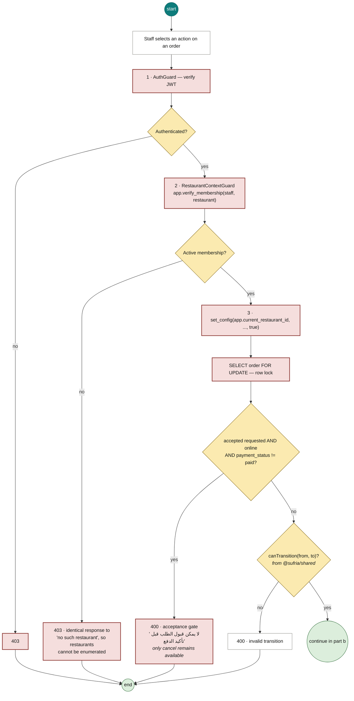
```mermaid
flowchart TB
    classDef start fill:#0E7C7B,stroke:#0A5F5E,color:#FFFFFF
    classDef act fill:#FFFFFF,stroke:#8A8A85,color:#161615
    classDef dec fill:#FBEAB0,stroke:#7A5C06,color:#161615
    classDef crit fill:#F5DEDD,stroke:#8A332F,stroke-width:2px,color:#161615
    classDef fin fill:#DCEEDC,stroke:#24632F,color:#161615

    S(("start")):::start --> A1["Staff selects an action on an order"]:::act
    A1 --> A2["1 · AuthGuard — verify JWT"]:::crit
    A2 --> D0{"Authenticated?"}:::dec
    D0 -- no --> E0["403"]:::crit --> F(("end")):::fin
    D0 -- yes --> A3["2 · RestaurantContextGuard<br/>app.verify_membership(staff, restaurant)"]:::crit
    A3 --> D1{"Active membership?"}:::dec
    D1 -- no --> E1["403 · identical response to<br/>'no such restaurant', so restaurants<br/>cannot be enumerated"]:::crit --> F
    D1 -- yes --> A4["3 · set_config(app.current_restaurant_id, ..., true)"]:::crit
    A4 --> A5["SELECT order FOR UPDATE — row lock"]:::crit
    A5 --> D2{"accepted requested AND online<br/>AND payment_status != paid?"}:::dec
    D2 -- yes --> E2["400 · acceptance gate<br/>'لا يمكن قبول الطلب قبل تأكيد الدفع'<br/><i>only cancel remains available</i>"]:::crit --> F
    D2 -- no --> D3{"canTransition(from, to)?<br/><i>from @sufria/shared</i>"}:::dec
    D3 -- no --> E3["400 · invalid transition"]:::act --> F
    D3 -- yes --> F3(("continue in part b")):::fin
```

## الشكل 3.18 — `10b-activity-status-apply`

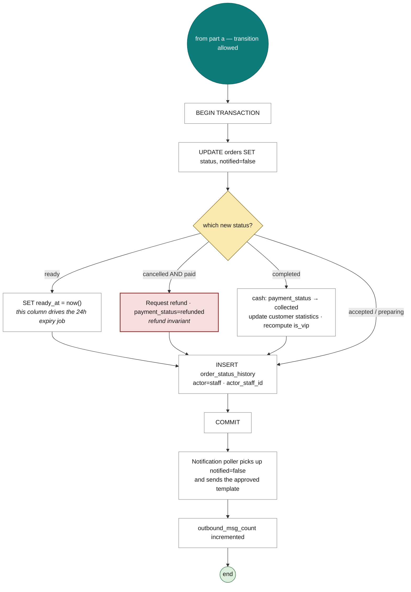
```mermaid
flowchart TB
    classDef start fill:#0E7C7B,stroke:#0A5F5E,color:#FFFFFF
    classDef act fill:#FFFFFF,stroke:#8A8A85,color:#161615
    classDef dec fill:#FBEAB0,stroke:#7A5C06,color:#161615
    classDef crit fill:#F5DEDD,stroke:#8A332F,stroke-width:2px,color:#161615
    classDef fin fill:#DCEEDC,stroke:#24632F,color:#161615

    S(("from part a — transition allowed")):::start --> A6["BEGIN TRANSACTION"]:::act
    A6 --> A7["UPDATE orders SET status, notified=false"]:::act
    A7 --> D4{"which new status?"}:::dec
    D4 -- ready --> B1["SET ready_at = now()<br/><i>this column drives the 24h expiry job</i>"]:::act --> A8
    D4 -- "cancelled AND paid" --> B2["Request refund · payment_status=refunded<br/><i>refund invariant</i>"]:::crit --> A8
    D4 -- completed --> B3["cash: payment_status → collected<br/>update customer statistics · recompute is_vip"]:::act --> A8
    D4 -- "accepted / preparing" --> A8["INSERT order_status_history<br/>actor=staff · actor_staff_id"]:::act
    A8 --> A9["COMMIT"]:::act
    A9 --> A10["Notification poller picks up notified=false<br/>and sends the approved template"]:::act
    A10 --> A11["outbound_msg_count incremented"]:::act
    A11 --> F2(("end")):::fin
```

## الشكل 3.19 — `14-seq-webhook-gate`

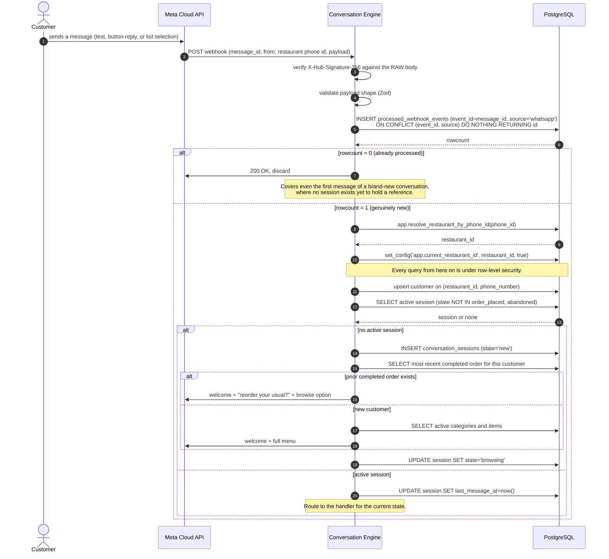
```mermaid
sequenceDiagram
    autonumber
    actor C as Customer
    participant WA as Meta Cloud API
    participant CE as Conversation Engine
    participant DB as PostgreSQL
    C->>WA: sends a message (text, button reply, or list selection)
    WA->>CE: POST webhook (message_id, from, restaurant phone id, payload)
    CE->>CE: verify X-Hub-Signature-256 against the RAW body
    CE->>CE: validate payload shape (Zod)
    CE->>DB: INSERT processed_webhook_events (event_id=message_id, source='whatsapp')<br/>ON CONFLICT (event_id, source) DO NOTHING RETURNING id
    DB-->>CE: rowcount
    alt rowcount = 0 (already processed)
        CE->>WA: 200 OK, discard
        Note over CE: Covers even the first message of a brand-new conversation,<br/>where no session exists yet to hold a reference.
    else rowcount = 1 (genuinely new)
        CE->>DB: app.resolve_restaurant_by_phone_id(phone_id)
        DB-->>CE: restaurant_id
        CE->>DB: set_config('app.current_restaurant_id', restaurant_id, true)
        Note over CE,DB: Every query from here on is under row-level security.
        CE->>DB: upsert customer on (restaurant_id, phone_number)
        CE->>DB: SELECT active session (state NOT IN order_placed, abandoned)
        DB-->>CE: session or none
        alt no active session
            CE->>DB: INSERT conversation_sessions (state='new')
            CE->>DB: SELECT most recent completed order for this customer
            alt prior completed order exists
                CE->>WA: welcome + "reorder your usual?" + browse option
            else new customer
                CE->>DB: SELECT active categories and items
                CE->>WA: welcome + full menu
            end
            CE->>DB: UPDATE session SET state='browsing'
        else active session
            CE->>DB: UPDATE session SET last_message_at=now()
            Note over CE: Route to the handler for the current state.
        end
    end
```

## الشكل 3.20 — `12-seq-cash-order`

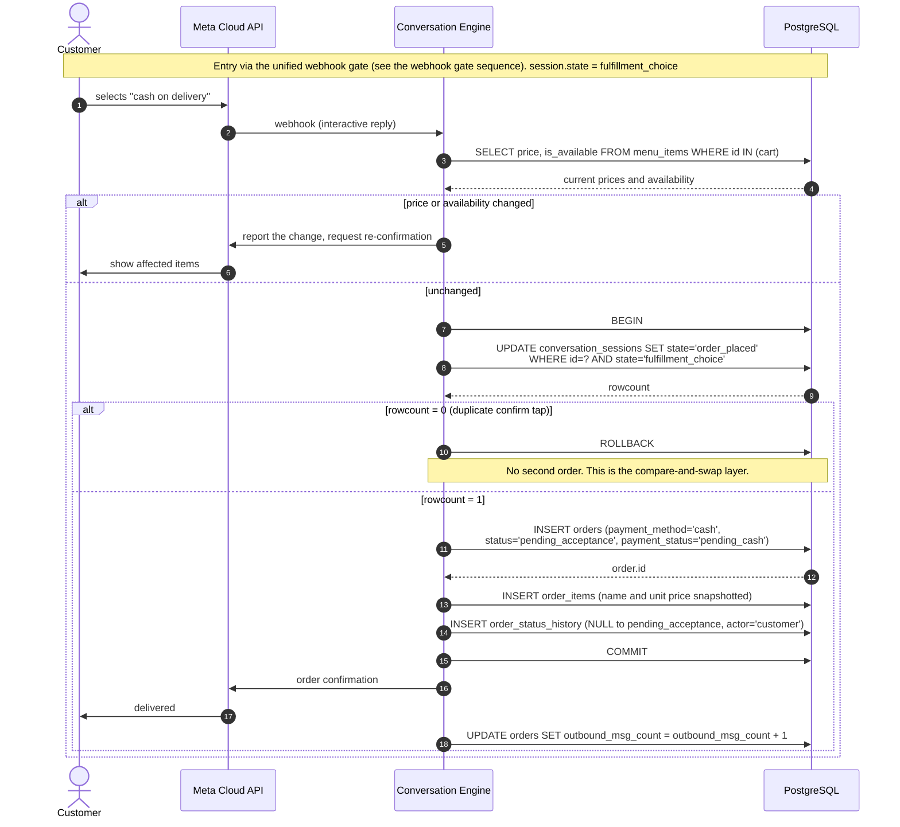
```mermaid
sequenceDiagram
    autonumber
    actor C as Customer
    participant WA as Meta Cloud API
    participant CE as Conversation Engine
    participant DB as PostgreSQL
    Note over C,DB: Entry via the unified webhook gate (see the webhook gate sequence). session.state = fulfillment_choice
    C->>WA: selects "cash on delivery"
    WA->>CE: webhook (interactive reply)
    CE->>DB: SELECT price, is_available FROM menu_items WHERE id IN (cart)
    DB-->>CE: current prices and availability
    alt price or availability changed
        CE->>WA: report the change, request re-confirmation
        WA->>C: show affected items
    else unchanged
        CE->>DB: BEGIN
        CE->>DB: UPDATE conversation_sessions SET state='order_placed'<br/>WHERE id=? AND state='fulfillment_choice'
        DB-->>CE: rowcount
        alt rowcount = 0 (duplicate confirm tap)
            CE->>DB: ROLLBACK
            Note over CE,DB: No second order. This is the compare-and-swap layer.
        else rowcount = 1
            CE->>DB: INSERT orders (payment_method='cash',<br/>status='pending_acceptance', payment_status='pending_cash')
            DB-->>CE: order.id
            CE->>DB: INSERT order_items (name and unit price snapshotted)
            CE->>DB: INSERT order_status_history (NULL to pending_acceptance, actor='customer')
            CE->>DB: COMMIT
            CE->>WA: order confirmation
            WA->>C: delivered
            CE->>DB: UPDATE orders SET outbound_msg_count = outbound_msg_count + 1
        end
    end
```

## الشكل 3.21 — `13-seq-online-payment`

```mermaid
sequenceDiagram
    autonumber
    actor C as Customer
    participant WA as Meta Cloud API
    participant CE as Conversation Engine
    participant DB as PostgreSQL
    participant PG as Payment Provider
    Note over C,PG: Customer selected online payment while in fulfillment_choice
    CE->>DB: BEGIN, then CAS to state='awaiting_payment'
    CE->>DB: INSERT orders (payment_method='online', payment_status='pending_online')
    CE->>DB: COMMIT
    Note over CE,DB: The order row exists BEFORE payment. Confirmation only updates it.
    CE->>PG: request payment instrument (amount, reference=order.id)
    PG-->>CE: hosted instrument + gateway_ref
    CE->>WA: send payment instrument
    WA->>C: delivered
    par session timeout path (never touches the order row)
        CE->>DB: (job) state='abandoned' WHERE state='awaiting_payment'<br/>AND last_message_at < now() - 45 min
    and payment confirmation path
        PG->>CE: payment webhook (gateway_ref, amount, success)
        CE->>DB: INSERT processed_webhook_events ON CONFLICT DO NOTHING RETURNING id
        DB-->>CE: rowcount
        alt rowcount = 0 (provider redelivery)
            CE->>PG: 200 OK only
        else rowcount = 1
            CE->>DB: SELECT order WHERE payment_gateway_ref=? FOR UPDATE
            DB-->>CE: locked order row
            CE->>CE: assert amount == order.total
            alt order already cancelled or expired
                CE->>DB: UPDATE payment_status='paid'
                CE->>PG: refund immediately (invariant fires inside THIS handler)
                PG-->>CE: refund confirmed
                CE->>DB: UPDATE payment_status='refunded'
                CE->>WA: explain and confirm the refund
            else pending_acceptance (normal path)
                CE->>DB: UPDATE payment_status='paid'<br/>WHERE payment_status='pending_online'
                CE->>DB: CAS session to 'order_placed'
                CE->>WA: payment received, order confirmed
            end
            CE->>PG: 200 OK
        end
    end
```

## الشكل 3.22 — `15-seq-status-update`

```mermaid
sequenceDiagram
    autonumber
    actor S as Restaurant Staff
    participant API as Dashboard API
    participant DB as PostgreSQL
    participant PG as Payment Provider
    participant SCH as Scheduler
    S->>API: PATCH /restaurants/{rid}/orders/{id}/status
    API->>DB: app.verify_membership(staff_id, restaurant_id)
    DB-->>API: active membership?
    alt no membership
        API-->>S: 403 (identical to "no such restaurant")
    else membership confirmed
        API->>DB: set_config('app.current_restaurant_id', rid, true)
        API->>DB: SELECT order WHERE id=? FOR UPDATE
        alt accepted requested AND online AND not paid
            API-->>S: 400 acceptance gate
        else transition allowed by canTransition()
            API->>DB: BEGIN
            API->>DB: UPDATE orders SET status, notified=false
            API->>DB: INSERT order_status_history (actor='staff', actor_staff_id)
            opt new status = ready
                API->>DB: SET ready_at = now()
            end
            opt cancelled AND payment_status = paid
                API->>PG: refund
                PG-->>API: confirmed
                API->>DB: UPDATE payment_status='refunded'
            end
            opt new status = completed
                API->>DB: cash: payment_status pending_cash to collected
                API->>DB: UPDATE customers total_orders, total_spend, last_order_at, is_vip
            end
            API->>DB: COMMIT
            API-->>S: 200 OK
        end
    end
    Note over SCH,DB: Independent scheduled paths
    SCH->>DB: expire pickups: status='ready' AND ready_at < now()-24h<br/>FOR UPDATE SKIP LOCKED
    SCH->>DB: cancel stuck online: payment_status='pending_online'<br/>AND created_at < now()-2h FOR UPDATE SKIP LOCKED
```

## الشكل 3.23 — `11-dfd-level1`

```mermaid
flowchart TB
    classDef ext fill:#E1EAEE,stroke:#35555F,color:#161615
    classDef proc fill:#FFFFFF,stroke:#0E7C7B,stroke-width:2px,color:#161615
    classDef store fill:#EDE6F7,stroke:#5B3A99,color:#161615

    CUST(["Customer"]):::ext
    STAFF(["Restaurant Staff"]):::ext
    META(["Meta Cloud API"]):::ext
    PAY(["Payment Provider"]):::ext

    P1["1.0<br/>Receive and<br/>authenticate<br/>webhook"]:::proc
    P2["2.0<br/>Manage<br/>conversation<br/>state"]:::proc
    P3["3.0<br/>Create and<br/>price order"]:::proc
    P4["4.0<br/>Manage order<br/>lifecycle"]:::proc
    P5["5.0<br/>Notify<br/>customer"]:::proc
    P6["6.0<br/>Aggregate<br/>analytics"]:::proc
    P7["7.0<br/>Authenticate and<br/>authorise staff"]:::proc

    D1[("D1 processed_webhook_events")]:::store
    D2[("D2 conversation_sessions")]:::store
    D3[("D3 menu_categories / menu_items")]:::store
    D4[("D4 orders / order_items")]:::store
    D5[("D5 order_status_history")]:::store
    D6[("D6 customers")]:::store
    D7[("D7 staff_accounts / restaurant_staff")]:::store

    CUST --> META --> P1
    PAY -->|"payment confirmation"| P1
    P1 -->|"event id"| D1
    D1 -->|"already processed?"| P1
    P1 -->|"new event"| P2

    P2 <-->|"state, cart context"| D2
    P2 -->|"menu request"| D3
    D3 -->|"categories, items, prices"| P2
    P2 -->|"confirmed cart"| P3

    P3 -->|"re-validate prices"| D3
    P3 -->|"order + items"| D4
    P3 -->|"creation entry"| D5
    P3 -->|"payment request"| PAY

    STAFF -->|"credentials"| P7
    P7 <-->|"membership check"| D7
    P7 -->|"verified restaurant context"| P4

    P4 <-->|"locked order row"| D4
    P4 -->|"transition entry"| D5
    P4 -->|"statistics on completion"| D6
    P4 -->|"refund request"| PAY
    D4 -->|"live orders"| STAFF

    P4 -->|"notified=false"| P5
    D4 --> P5
    P5 -->|"approved template"| META --> CUST
    P5 -->|"outbound_msg_count"| D4

    D4 --> P6
    D6 --> P6
    D2 -->|"furthest state per session"| P6
    P6 -->|"orders, revenue, ownership score,<br/>funnel, at-risk customers"| STAFF
```

## الشكل 3.23 — `16-seq-proactive-reorder`

```mermaid
sequenceDiagram
    autonumber
    actor C as Returning Customer
    participant WA as Meta Cloud API
    participant CE as Conversation Engine
    participant DB as PostgreSQL
    Note over C,DB: FR-08 — the highest business priority requirement.<br/>Target: first message to confirmed order in under 30 seconds.
    C->>WA: "مرحبا"
    WA->>CE: webhook (after signature check and dedup gate)
    CE->>DB: resolve restaurant, upsert customer, create session (state='new')
    CE->>DB: SELECT most recent completed order for this customer<br/>at this restaurant (idx_orders_customer_completed)
    DB-->>CE: prior order + its items
    alt no prior completed order
        CE->>WA: welcome + full menu
        CE->>DB: session state='browsing'
    else prior order exists
        CE->>DB: re-validate price and availability of EVERY item now
        DB-->>CE: current prices and availability
        alt one or more items unavailable
            CE->>WA: welcome + "your usual is partly unavailable" +<br/>name the affected items + substitute or remove
            Note over CE,WA: The suggestion is never shown with a stale price<br/>or an item the kitchen cannot make.
        else all items still available
            CE->>WA: welcome + "reorder your usual? [items, total]"<br/>+ "browse the menu instead"
        end
        alt customer confirms
            CE->>DB: pre-fill session.context with the same items
            CE->>DB: CAS session state to 'cart_review'
            CE->>WA: cart summary and total, ready to confirm
            Note over C,DB: Browsing is skipped entirely — this is the<br/>whole point of the requirement.
        else customer dismisses
            CE->>DB: session state='browsing'
            CE->>WA: full menu
        end
    end
```

## الشكل 3.24 — `17-seq-payment-timeout`

```mermaid
sequenceDiagram
    autonumber
    actor C as Customer
    participant WA as Meta Cloud API
    participant CE as Conversation Engine
    participant DB as PostgreSQL
    participant SCH as Scheduler
    Note over C,SCH: Starting point: an order exists with payment_status='pending_online'.<br/>Two independent outcomes, and they can race.
    rect rgba(220,238,220,0.35)
        Note over C,DB: Path A — customer switches to cash (one-directional, same order row)
        C->>WA: "pay cash instead"
        WA->>CE: webhook
        CE->>DB: SELECT order WHERE session_id=? FOR UPDATE
        CE->>DB: UPDATE orders SET payment_method='cash',<br/>payment_status='pending_cash'<br/>WHERE payment_status='pending_online'
        CE->>DB: INSERT order_status_history<br/>(actor='customer', reason='payment_method_switched_to_cash')
        CE->>DB: CAS session to 'order_placed'
        CE->>WA: switch confirmed
        Note over CE,DB: Defensive: if a late confirmation arrives for the OLD link,<br/>payment_status is recorded as 'paid' and a flag is raised on the<br/>dashboard so cash is not collected twice.
    end
    rect rgba(245,222,221,0.35)
        Note over SCH,DB: Path B — nobody pays, nobody switches
        SCH->>DB: SELECT orders WHERE payment_status='pending_online'<br/>AND created_at < now() - 2h FOR UPDATE SKIP LOCKED
        DB-->>SCH: eligible orders
        SCH->>DB: UPDATE orders SET status='cancelled', cancelled_by='system',<br/>cancellation_reason='payment_timeout_2h'<br/>WHERE payment_status='pending_online'
        DB-->>SCH: rowcount
        alt rowcount = 0
            Note over SCH: Payment landed in the same instant. Leave it alone.
        else rowcount = 1
            SCH->>DB: INSERT order_status_history (actor='system')
            Note over SCH,DB: No refund — payment_status was never 'paid'.
            SCH->>CE: notified=false picked up by the poller
            CE->>WA: "payment was not completed within the time limit"
            Note over CE,WA: The wording describes payment, not the customer.<br/>The system only knows payment never confirmed.
        end
    end
```

## الشكل 3.25 — `18-seq-concurrent-cancel`

```mermaid
sequenceDiagram
    autonumber
    participant TRIG as Cancellation trigger<br/>(staff · 24h expiry · 2h timeout)
    participant API as Dashboard API / Scheduler
    participant DB as PostgreSQL
    participant CE as Conversation Engine
    participant PG as Payment Provider
    Note over TRIG,PG: The refund invariant: any order entering cancelled or expired<br/>while payment_status='paid' is refunded EXACTLY ONCE,<br/>no matter which event arrives first or how far apart.
    par cancellation side
        TRIG->>API: cancel / expire this order
        API->>DB: SELECT order WHERE id=? FOR UPDATE
    and payment side
        PG->>CE: payment confirmation webhook
        CE->>DB: INSERT processed_webhook_events ON CONFLICT DO NOTHING
        CE->>DB: SELECT order WHERE payment_gateway_ref=? FOR UPDATE
    end
    Note over DB: The row lock admits exactly one of the two first.<br/>The second blocks, then re-reads committed state.
    alt cancellation committed first
        API->>DB: status='cancelled'
        API->>DB: COMMIT (releases the lock)
        CE->>DB: (lock acquired) re-read: status is already 'cancelled'
        CE->>DB: UPDATE payment_status='paid'
        CE->>PG: refund — fires inside THIS handler
        PG-->>CE: refund confirmed
        CE->>DB: UPDATE payment_status='refunded'
        CE->>CE: notify the customer
    else payment committed first
        CE->>DB: payment_status='paid'
        CE->>DB: COMMIT (releases the lock)
        API->>DB: (lock acquired) re-read: payment_status is already 'paid'
        API->>DB: status='cancelled'
        API->>PG: refund — fires in the cancellation path
        PG-->>API: refund confirmed
        API->>DB: UPDATE payment_status='refunded'
    end
    Note over TRIG,PG: Exactly one refund in both orderings. The invariant is a property<br/>of the state, not of which code path noticed it.
```
