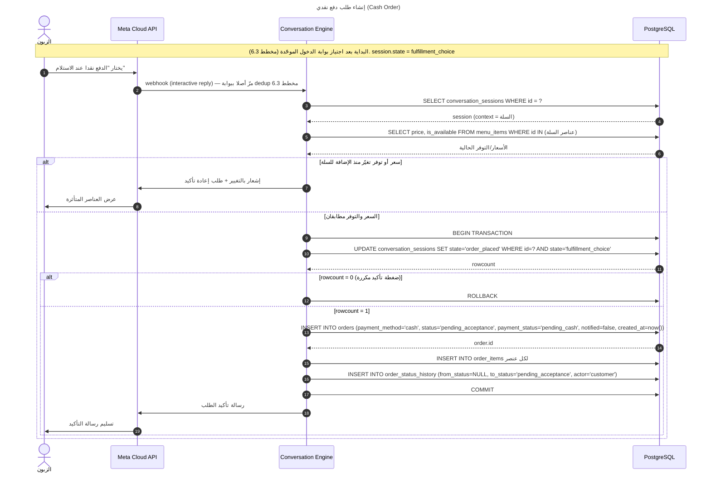
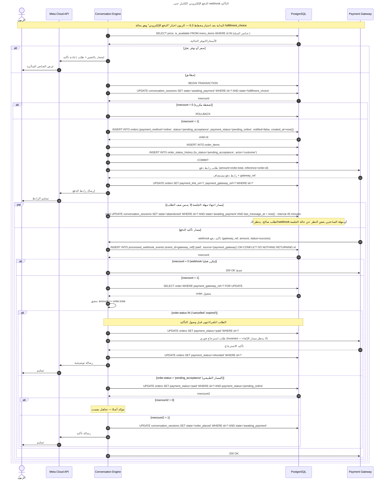
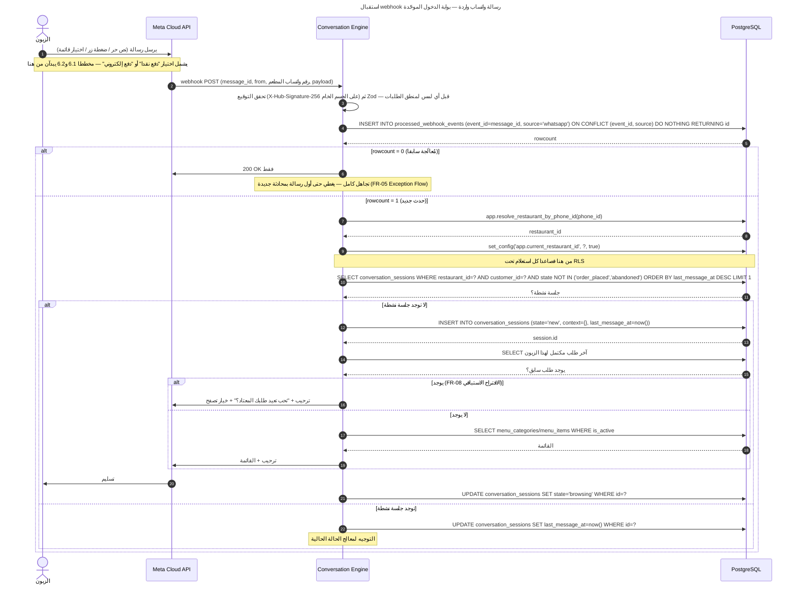
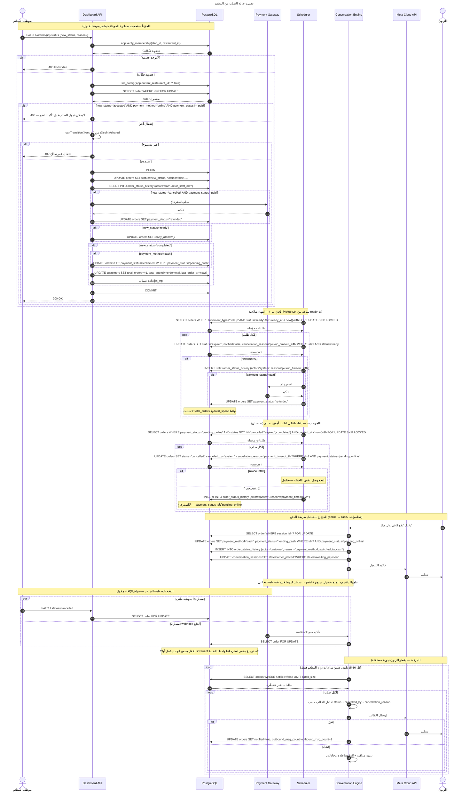

# ملف سياق مشروع "وفا" — البلوبرينت **v2.0**

> **تحديث ١٤ أغسطس ٢٠٢٦.** هذا الملف يحل محل كل النسخ السابقة بالكامل.
>
> **ما تغيّر في v2.0 (ملخص، التفصيل داخل الأقسام):**
> 1. 🔴 **تصحيح تحقُّق في §5.1** — ادعاء "أول 1000 محادثة مجانا" **غير صحيح** منذ يوليو 2025، وأُضيف حساب التكلفة المتغيرة بعد 1 أكتوبر 2026
> 2. 🔴 **إعادة صياغة التموضع في §2** — حُلَّ تناقض بين "المشكلة" و"الـICP" كان قائما في كل النسخ السابقة
> 3. 🔴 **تحديث المنافسة في §2** — Nexara (الأردن، 2024) و POSRocket و Foodics. الادعاء السابق "الشام مخدوم بأدوات QR فقط" لم يعد دقيقا
> 4. 🟠 **اكتشاف CliQ في §5.4** — قد يغيّر نطاق Sprint 2 بالكامل
> 5. ✅ **§5.5 و §5.7 حُدِّثا بما نُفِّذ فعليا** — Drizzle مقفول، monorepo، أربعة فروقات schema، إصدارات محقَّقة
> 6. ✅ **§11 جديد** — سجل مخاطر مرتّب
>
> **المرجع الرسمي للمتطلبات: `Sufria_SRS` نسخة 1.2.** هذا الملف قرارات تقنية + مخططات + خطة تنفيذ.

---

## 1. السياق العام

- **البرنامج:** تدريب "طاقات" (غير تقني، تشكيل فرق، احتمال احتضان). مهلة 3 شهور لبناء MVP وعرضه على لجنة تحكيم.
- **الدعم المؤكد:** مساحة عمل + مينتورشيب. لا مبلغ مالي مضمون.
- **الفريق:** مكتمل تقنيا — مصمم، باك اند (2)، فرونت اند، + الفاوندر. **⚠️ لا يوجد أي دور بزنس/تسويق. هذا أخطر ضعف في المشروع، وليس بندا تقنيا** (§11).
- **بنية التكلفة:** تُقرأ من §5.1 **بعد التصحيح**. الملخص: قريبة من صفر **حتى 1 أكتوبر 2026 فقط**، وبعدها تظهر تكلفة متغيرة لكل طلب.
- **قرار تقني تأسيسي:** بناء Backend كامل من الصفر — ملكية حقيقية على المنطق الجوهري، لا configuration فوق منصة جاهزة.
  > **توضيح أُضيف في v2:** هذا القرار عن **مكان منطق التطبيق**، لا عن **من يستضيف عملية PostgreSQL**. استخدام Supabase أو Neon كـPostgreSQL مُدارة لا يمسّه: الـschema والـmigrations وسياسات RLS و NestJS كلها ملكنا، ولا سطر واحد من الكود يعرف من يستضيف القاعدة.

---

## 2. الفكرة المعتمدة

**الاسم المؤقت:** "وفا".

### التموضع — الصياغة المعتمدة (v2)

> **منصة تمكّن المطعم من التوقف عن دفع عمولة على زبون كسبه بالفعل.**
> الزبون يكتشف المطعم عبر تلبات/كريم؛ ومن الطلب الثاني يطلب مباشرة عبر واتساب.
> **واتساب قناة أولى، وليس المنتج نفسه.**

### 🔴 لماذا تغيّرت الصياغة — تناقض حقيقي كان قائما

| الوثيقة | ما كانت تقول | نوع المشكلة |
|---|---|---|
| SRS §1.2 | *"restaurants depend heavily on aggregators **to reach customers**"* | **اكتشاف** |
| البلوبرينت §2 (ICP) | *"مطاعم عندها **قاعدة زبائن متكررين موجودة أصلا**"* | **احتفاظ** |

**كنا نعرّف المشكلة بشيء ونستهدف مَن لا يعانيها.** والنتيجة المنطقية لهذا التناقض:

> المطاعم ذات **أكبر ألم** (معتمدة كليا على التطبيقات، بلا قاعدة متكررة) تحصل على **أقل قيمة** من وفا.
> والمطاعم ذات **أكبر قيمة** (قاعدة متكررة قوية) لديها **أقل ألم**.

الصياغة الجديدة تحلّ التناقض، وتعترف صراحة بأن **وفا لا تجلب زبونا جديدا**، **وتجعل تلبات شريكا لا عدوا** — وهو تموضع أقوى تجاريا لأنه لا يطلب من المطعم ترك قناة تجلب له اكتشافا.

❌ ليست "بديل تلبات". ❌ وليست "ميزة طلب واتساب". ✅ المشكلة المستهدفة: **امتلاك علاقة المطعم بعميله المتكرر**.

**نموذج الربح:** اشتراك شهري ثابت (SaaS)، ليس عمولة. ⚠️ اقرأ §5.1 — هناك تكلفة متغيرة لكل طلب اعتبارا من 1 أكتوبر 2026، ويجب أن يستوعبها السعر.

**ICP:** مطاعم مستقلة/سلاسل صغيرة (2-15 فرع) بالأردن والشام، **لديها قاعدة زبائن متكررين لكنهم ما زالوا يطلبون عبر التطبيقات بحكم العادة**.

### 🔴 بحث المنافسة — مُحدَّث (أغسطس 2026)

**الادعاء السابق ("الشام والأردن مخدومان بأدوات QR بسيطة فقط، لا بوت محادثة حقيقي") لم يعد دقيقا.**

| المنافس | البلد | التأسيس | المنتج | السعر |
|---|---|---|---|---|
| 🔴 **Nexara** | **الأردن** | 2024 | طلب مباشر · **تكامل CliQ** · POS · موقع · كول سنتر · تحليلات | **~$99/شهر/فرع** |
| **POSRocket** | الأردن | 2017 | POS سحابي، تقارير | ~$41/شهر |
| **Foodics** | السعودية | 2014 | POS · مخزون · طلب أونلاين، 35+ دولة | ~$53-106/شهر |
| **Deonde** | عالمي | — | منصة شاملة (تتبع سائق، POS) — يناقض قرارنا #2 | — |
| **MenuITD** | الإمارات | — | طلب واتساب للإمارات | — |

**Nexara تحديدا تنشر محتوى تسويقيا بعناوين حرفية مثل "لماذا تدفع المطاعم الأردنية 30% لتلبات وهي ليست مضطرة" — أي نفس الرسالة، نفس البلد، نفس الزبون.**

وعلى المستوى العالمي، فئة "طلب واتساب يوفّر عمولة 20-30%" أصبحت **سلعة**: AeroChat · uEngage · WhatServe AI · Menubly.

#### الخطر الحقيقي ليس المنافس — بل الادعاء القديم

Nexara **ليست خطرا وجوديا**: منتجها منصة عريضة (POS، كول سنتر، موقع)، ووفا محرك محادثة + تحليلات احتفاظ. **منتجان مختلفان.**

> **الخطر أن يفتح محكّم جوجل ثلاثين ثانية، فيجد شركة أردنية تبيع نفس الرسالة، ثم يعود إلى وثيقتنا التي تقول "لا منافس بهذا المستوى".**
> **عندها يصبح كل رقم آخر في الوثيقة موضع شك — بما فيه الصحيح.**

**القاعدة: نذكرهم نحن أولا، بالاسم، مع الفرق. الفريق الذي يعرف منافسيه بالاسم يبدو أقوى من الذي يقول لا منافسين.**

### التمايز (بعد التحديث)

1. **عمق المحادثة** — بوت بآلة حالات حقيقية، لا رابط قائمة. الفجوة مؤكدة: تطبيق WhatsApp Business المجاني فيه كتالوج، **بلا سلة وبلا دفع**
2. **البساطة كموضع تنافسي** — ضد منصات عريضة (Nexara، Foodics) تطلب من المطعم تغيير نظامه كله
3. **فيتشرز امتلاك العلاقة** (FR-18–FR-21) — يصعب على منافس عمولة نسخها **بنيويا**
4. **FR-08 (إعادة الطلب الاستباقية)** — الميزة الوحيدة التي **الزبون** يشعر بأنها أفضل من تلبات، لا المطعم فقط

---

## 3. المتطلبات

المرجع الكامل: **`Sufria_SRS` v1.2** (FR-01→21، NFR-01→12).

**تصحيحات v1.1 (مطبَّقة):** FR-10 (توقيت إنشاء الطلب) · FR-11 (نطاق الإشعار) · FR-13 (بوابة القبول، المهلتان، `collected`) · NFR-09.

**تصحيحات v1.2 (هذه الجولة):** §1.2 إعادة صياغة المشكلة والمنافسة · §1.4 القيود (BSP أُزيل، تسعير أكتوبر أُضيف) · §1.7.2 الأدوات (360dialog أُزيل، Drizzle مقفول، Zod مقفول) · NFR-07 (صياغة النشر).

---

## 4. القرارات التأسيسية (سبعة، مقفولة)

| # | القرار | ملاحظة |
|---|---|---|
| 1 | الإطلاق بأي بلد فيه تجربة حقيقية ممكنة | **⚠️ لسا مفتوح** — الأردن موصى به. يُقفل الأحد 16 أغسطس |
| 2 | التوصيل مسؤولية المطعم — لا تتبع سائق/ETA | تناقض واعٍ مع Deonde |
| 3 | رقم واتساب مستقل لكل مطعم | تحقق ميتا 2-5 أيام (حتى 30) — **أطول عنصر انتظار** |
| 4 | قائمة الطعام self-service بالكامل | onboarding يدوي مقبول لأول 1-2 مطعم |
| 5 | بديل عند تعطل واتساب: roadmap فقط | مدعوم ببنية `channel` على customers |
| 6 | الدفع: online + cash، كل مطعم يحدد | ⚠️ اقرأ §5.4 — CliQ قد يغيّر معنى "online" بالأردن |
| 7 | دعم السلاسل: `chain_id` + عضوية متعددة | ✅ **مُنفَّذ ومُختبَر** — 12 assertion |

**⚠️ المطعم التجريبي: لسا غير محدد.** انتأجّل رسميا لـ**Sprint 4 (4 أكتوبر)**، والتطوير لحد وقتها بيمشي على **مطعم صفر** — بيانات بذرية واقعية (S0-17) + **رقم واتساب اختباري مجاني** (S0-B1). القرار وحجّته الكاملة في §11.

**🔴 والخطر اللي بدله على رأس القائمة: صفر محادثات مع أصحاب مطاعم.** المطلوب **5 محادثات لحد 3 سبتمبر** (S0-B2) — مش تثبيت مطعم.

---

### 4.1 بلد الإطلاق — 🇯🇴 الأردن (موصى به · يُقفل 3 سبتمبر)

**التصحيح أولا:** كان هذا البند مُدرَجا كـ"أخطر قرار، يُقفل 16 أغسطس، ويوقف كل ما بعده". **فحص الكود أبطل ذلك.** الاعتماد الوحيد على البلد في المخطط كله:

```
db/migrations/0001_enums_and_tables.sql:294
  currency  char(3) NOT NULL DEFAULT 'JOD'
```

عمود واحد، في جدول `subscriptions`، لا يُبنى قبل Sprint 3. **البلد لا يوقف أي مهمة هندسية في Sprint 0 ولا Sprint 1.** موعده الحقيقي هو بداية تخطيط Sprint 2 (3 سبتمبر)، حيث تُختار بوابة الدفع.

**الحجة للأردن:**

| العامل | الرقم | الأثر |
|---|---|---|
| عمولة طلبات على المطاعم الأردنية | **30%** (منشور من Nexara، المنافس المباشر) | قصة الـROI تصبح حسابا لا شعارا |
| CliQ مقابل البطاقات | **0.3–0.8%** مقابل 2.5–3.5% | Sprint 2 أرخص، و"بلا عمولة" تصبح صادقة حسابيا |
| البلوبرينت والـSRS والتسعير | معايَرة على الأردن **أصلا** | تغيير البلد = إعادة كتابة §4 والتسعير ونصف Sprint 2، بلا مكسب |

**وجود Nexara ليس سببا للهرب — هو الدليل الوحيد المتاح على أن السوق يدفع.** سوق بلا منافس هو سوق لم يجرّبه أحد.

**البديل الجدي الوحيد: 🇵🇸 الضفة الغربية.** المشكلة قائمة فعلا (Yummy · Delivin · Del · CatchFood · Tawasi تغطي نابلس ورام الله وبيت لحم والخليل وأريحا وقلقيلية وجنين). البنية قائمة: 3G منذ 2018، و4G أُقرّت في يناير 2026 وقيد النشر. الدفع قائم: **PalPay** و**Jawwal Pay** لديهما بوابتا تجارة إلكترونية للتجار. السوق أصغر بكثير. **التغيير المطلوب لو اختيرت:** `currency → 'ILS'` + بوابة PalPay أو Jawwal Pay في Sprint 2. لا شيء غير ذلك.

**🔴 غزة مستثناة — لأسباب المنتج نفسه، لا لأسباب إنسانية:**

1. **لا مجمّعات طلبات في غزة أصلا** (كل التطبيقات أعلاه تغطي الضفة فقط) → **لا عمولة 30% لتوفيرها** → **ROI المنتج = صفر حسابيا**، لا "ضعيف"
2. **FR-02 و FR-08 تنهاران:** مطاعم غزة تعمل ساعات قليلة يوميا **بحسب ما وصل صباحا، بلا قائمة ثابتة** (تقارير فبراير 2026). و**FR-08 — أعلى أولوية عمل في المنتج — تفترض "طلبا معتادا بسعر معتاد"**. وجبة برغر ≈ **30 دولارا** (يناير 2026). "المعتاد" لا وجود له
3. **FR-10 معكوسة لا مفقودة:** النقد الرقمي في غزة يساوي **أقل** من الكاش — عمولات سماسرة الكاش **15–40%**. محفظة "إبراق" بلغت **نصف مليون مستخدم (ربع السكان) وفشلت لأن التجار أصرّوا على النقد**. "ادفع أونلاين" هناك = خصم على المطعم، لا راحة للعميل
4. **البنية:** غزة على **2G فقط**؛ ترقية 4G المُقرّة في يناير 2026 **للضفة وحدها، وغزة مستثناة صراحة**

**غزة قد تكون مكان البناء. ليست مكان البيع.**

> **قاعدة الحسم:** بلد الإطلاق = البلد الذي يمكنك دخول مطعم فيه **هذا الأسبوع**. لا الأكبر ولا الأعلى دفعا. لأن أكبر خطر في المشروع الآن ليس تقنيا — بل أنه لم تجرِ ولا محادثة مع صاحب مطعم، وهذا الخطر لا يُغلق إلا بالقرب الجسدي. **وأي بلد يُكتب اليوم هو سطر في ملف، لا قرار، حتى تكتمل الـ5 محادثات (S0-B2).**

---

## 5. الهيكلة التقنية

### 5.1 🔴 تكلفة الرسائل — مُصحَّحة بالكامل

#### الخطأ الذي كان في كل النسخ السابقة

> النسخ السابقة: *"رسائل الخدمة مجانية، **بالإضافة إلى أول 1000 محادثة يبدأها الزبون شهريا مجانا**"*

**الشطر الثاني غير صحيح.** باقة الـ1000 محادثة تنتمي لنموذج التسعير القديم القائم على المحادثات، **والذي انتهى مع تحوّل ميتا إلى per-message في 1 يوليو 2025**. توثيق ميتا الحالي ينصّ صراحة على عدم وجود tier مجاني بعدد المحادثات؛ التسعير على **نوع الرسالة وفئتها**.

#### الوضع الفعلي اليوم (أغسطس 2026)

- الرسائل الواردة من الزبون: **مجانية**
- ردودنا غير القالبية داخل نافذة الـ24 ساعة: **مجانية** ← وهذا يغطي تدفق وفا بالكامل تقريبا
- **النتيجة: تكلفة الرسائل اليوم ≈ صفر. الاستنتاج كان صحيحا رغم أن أحد مقدماته كان خاطئا.**

#### 🔴 ما يتغيّر في 1 أكتوبر 2026

**ردود الخدمة داخل نافذة الـ24 ساعة تصبح مدفوعة**، بسعر مقارن بقوالب الـutility حسب البلد.

```
السعر المنشور "Rest of Middle East" (يشمل الأردن):   ~$0.0091 / رسالة
عدد الرسائل الصادرة للطلب الواحد (تقدير):              ~12
──────────────────────────────────────────────────────────────
التكلفة المتغيرة للطلب الواحد:                        ~$0.11
× 300 طلب/شهر  =                                      ~$33 / مطعم / شهر
```

#### الأثر الاستراتيجي — أهم فقرة في هذا القسم

> **وفا لديها تكلفة متغيرة لكل طلب، في منتج تموضعه الحرفي "اشتراك ثابت بدون عمولة على الطلبات".**

1. **عدد الرسائل للطلب صار متغيرا هندسيا، لا بندا محاسبيا.** كل رسالة "تأكيد" إضافية لها سعر. `orders.outbound_msg_count` أُضيف للـschema لقياسه من أول طلب حقيقي (ADR-002).
2. **البايلوت يبدأ 4 أكتوبر — أي بعد يوم واحد من سريان التغيير.** **لن يعمل ولا يوم واحد تحت الرسائل المجانية.** هذا ليس خطرا؛ بل يعني أن كل رقم يُجمع في البايلوت سيكون بالتكلفة الحقيقية.
3. **الجملة "تكلفة تشغيل الـMVP قريبة من صفر" تتوقف عن الصحة قبل أن يبدأ البايلوت.**
4. **السعر المرجعي متاح:** Nexara بـ$99/شهر لمنتج أعرض. هناك مساحة سعرية فوقنا.

⚠️ **الأسعار الرسمية لم تُنشر بعد** حتى تاريخ هذا التحديث. الرقم أعلاه من rate card تابعة لـBSP. **تحقّق من ميتا مباشرة في 1 سبتمبر.**

**قاعدة تنفيذية: لا يُثبَّت سعر الاشتراك قبل 1 سبتمبر 2026.**

### 5.2 المعمارية العامة

**الزبون (واتساب) → Meta Cloud API (webhook) → محرك المحادثة (NestJS) → PostgreSQL** ← → **لوحة تحكم المطعم (Next.js, polling)**.

كل webhook وارد يمر أولا ببوابة dedup موحّدة (`processed_webhook_events`) قبل أي منطق جلسة أو طلب (§5.6، مخطط 6.3).

**🆕 قرار v2 — مستودع واحد (monorepo):** الخطة السابقة كانت 3 ريبوهات. **بعد التنفيذ الفعلي تبيّن أنه خطأ:** مشاركة الأنواع بين الخدمتين والفرونت اند تتطلب نشر حزمة npm أو submodules. بـpnpm workspaces تصبح `import { canAcceptOrder } from '@sufria/shared'`. الخدمتان مستقلتان **بالنشر**، مشتركتان **بالمستودع**.

### 5.3 قناة واتساب: Meta Cloud API مباشرة (بدون BSP)

**قرار مُصحَّح.** النسخة الأصلية كتبت 360dialog (~€49/شهر) كأنه ضرورة — **وهذا كان خطأ تحقُّق**.

Meta تشغّل WhatsApp Cloud API على سيرفراتها ومتاحة **مباشرة بدون وسيط**: صفر رسوم منصة، صفر استضافة، بلا عقود. قيمة الـBSP الحقيقية هي بنية جاهزة (معالجة webhooks، صندوق وارد، واجهة) — **ونحن نبني كل هذا بأنفسنا أصلا**.

**الأثر على المعمارية: صفر.**

⚠️ مواقع الـBSPs تدّعي أحيانا "لا يمكن الوصول للـAPI بدون BSP" — تسويق يناقض توثيق ميتا. **تحقّق دائما من مصدر أول.**

**توسّع مستقبلي:** عند عشرات المطاعم يلزم تسجيل **Tech Provider** لاستخدام Embedded Signup. خارج المهلة الحالية.

### 5.4 🟠 بوابة الدفع — اكتشاف يغيّر Sprint 2

**قاعدة تكلفة أولا:** بوابات الدفع الإقليمية بلا رسوم شهرية — نسبة على المعاملة فقط. وبما أن طلبات الكاش لا تحتاج بوابة (قرار #6)، **يبدأ البايلوت كاش فقط**.

#### 🔴 CliQ — لم يكن مذكورا في أي نسخة سابقة

| الطريقة (الأردن) | رسوم التاجر | التسوية |
|---|---|---|
| **CliQ** (نظام الدفع الفوري الوطني) | **0.3 – 0.8%** | **فورية** |
| بطاقة ائتمان | 2.5 – 3.5% + رسوم بوابة 0.5-1% | T+1 → T+5 |
| بطاقة خصم | 1.8 – 2.2% + بوابة | T+1 → T+5 |

**والأهم: الكاش و CliQ هما المسيطران في الأردن؛ اعتماد البطاقات محدود بسبب الكلفة.**

على 10,000 دينار مبيعات شهريا، الفرق **120-270 دينار شهريا** لصالح CliQ.

#### الأثر على الخطة

Sprint 2 (أسبوعان، موصوف في §10 بأنه **"أخطر بند تقني"**) مصمَّم حول بوابة بطاقات.

> **الاحتمال قائم أن نصرف أخطر أسبوعين في المشروع على تكامل بوابة بطاقات، لطريقة دفع لا يفضّلها الزبون الأردني ويدفع عليها المطعم أربعة أضعاف.**

⚠️ **بحذر:** CliQ يعمل عبر QR ثابت/ديناميكي أو alias، **ولم يُعثر على توثيق API عام للتأكيد التلقائي**. أي أن تدفق "رابط دفع → webhook تأكيد" في مخطط 6.2 **قد لا يكون ممكنا مع CliQ**؛ البديل تأكيد يدوي من اللوحة — تدفق مختلف تماما.

#### 🔴 بوابة إلزامية قبل 6 سبتمبر

**تحقّق مباشرة:** هل يوجد مزوّد أردني يوفّر CliQ مع تأكيد تلقائي (API/webhook)؟ (بنك أردني · Network International Jordan · JoPACC)

- **يوجد API** → يتغيّر هدف Sprint 2 إلى CliQ
- **لا يوجد** → **الدفع الإلكتروني ينزل من Sprint 2**؛ البايلوت كاش (وهو القرار الأصلي أصلا)، والأسبوعان يذهبان للإشعارات + إدارة القائمة + بايلوت أطول

**بكلتا الحالتين هذا السؤال يستحق يوم بحث قبل أن يستهلك أسبوعين تطوير.**

**البدائل إن لزمت بطاقات:** HyperPay (يغطي الأردن) · Tap (تسعير معلن 2.75%/3.25%؛ قدرته على إبطال رابط دفع **غير مؤكدة** — والتصميم لا يعتمد عليها أصلا).

### 5.5 الـStack — مُقفل ومُحقَّق (ADR-003)

| البند | القرار | الحالة |
|---|---|---|
| قاعدة البيانات | **PostgreSQL 16** + RLS أصيلة | ✅ منفَّذ ومُختبَر |
| Backend | **NestJS 11.2** + TypeScript | ✅ |
| **ORM** | **Drizzle `~0.45.2`** | ✅ **مقفول** — ADR-001 |
| **التحقق** | **Zod 4** + `nestjs-zod` | ✅ **مقفول** — كان "Zod أو class-validator" |
| **الاختبار** | **Vitest 4** | ✅ **مقفول** — لم يكن مذكورا |
| Auth | JWT + Refresh + **argon2id** | — |
| Multi-tenancy | RLS + Guard **قبل** ضبط السياق | ✅ **مُختبَر: 12 assertion + 3 ضوابط سالبة** |
| Logging | **Pino 10** | — |
| 🆕 تتبّع الأخطاء | **Sentry** | 🔴 **فجوة — إلزامي قبل البايلوت** |
| 🆕 مراقبة uptime | UptimeRobot / BetterStack | 🔴 **فجوة** |
| Object Storage | Cloudflare R2 | — |
| الواجهة | **Next.js 16 / React 19**، polling | ⚠️ تُستخدم كتطبيق client-side |
| المستودع | **monorepo، pnpm workspaces** | ✅ |

#### 🔴 قيد إصدار حرج

> **TypeScript مثبَّت على `~5.9.3`. ممنوع الترقية إلى TypeScript 7.**
> TS 7 (المُصرَّف بـGo) صدرت وتكسر `nest build`: لا تملك compiler API برمجية، و`nest build` يستوردها كمكتبة وينادي `createProgram()`. نفس الشيء يكسر ts-jest و ts-loader و ESLint النوعي. **الديكوريتورات نفسها تعمل — البناء لا.**

**كذلك:** drizzle-orm عند 0.45.2 مستقرة و**v1 ما زالت release candidate** — لا تُلاحَق في منتصف المشروع.

#### 🔴 تعديل على النشر — أُقرّ في v2

النسخة السابقة: خدمتان منفصلتان بالنشر من اليوم الأول. **صحيح معماريا، سابق لأوانه عمليا:**

- الاستضافة المجانية تعطي **خدمة always-on واحدة**؛ خدمتان = دفع أو خدمة نائمة (وهي بالضبط ما لا يصلح للمحرك)
- ضِعف إعداد النشر ومتغيرات البيئة والمراقبة، لفريق من اثنين وعشرة أسابيع
- سؤال زائد: من يملك الـschedulers؟

**القرار: موديولان منفصلان تماما في الكود، وprocess واحد في البايلوت.** الفصل الفعلي = إضافة `main.ts` ثانية، لا إعادة كتابة. **يُنفَّذ عندما يفرض حمل الـwebhooks scaling مختلفا — أي بعد 10+ مطاعم.**

### 5.6 محرك المحادثة (State Machine)

```
new → browsing → cart_review → fulfillment_choice
    → [cash: تخطي مباشر] → order_placed (نهائية)
    → [online: awaiting_payment] → order_placed (نهائية)
abandoned (نهائية، من أي حالة قبل order_placed)
```

**القواعد النهائية:**

- **توقيت إنشاء صف الطلب:** صف `orders` يُنشأ **فورا** لحظة اختيار طريقة الدفع، cash أو online. الفرق الوحيد `payment_status` الابتدائي. **webhook الدفع لا ينشئ صف طلب أبدا — يحدّث صفا موجودا.**
  - ⚠️ **انحراف منفَّذ في المهمة ج:** لا سؤال عن طريقة الدفع في البايلوت (كاش وحده، §2.5 هناك)، فالطلب يُنشأ عند كلمة **«أكّد»** بعد ملخّص كامل. ويُدرَج بـ`notified = true` صراحة، لأن المحرّك نفسه يرسل «استلمنا طلبك» بعد الـCOMMIT — و`notified = false` تعني «المُراقِب يرسل»، فتركها افتراضية = رسالتان للزبون. **المُراقِب لا يرسل شيئا لطلب في `pending_acceptance`.**
- **Idempotency على طبقتين مكمّلتين، لا تعوّض إحداهما الأخرى:**
  1. **مستوى الحدث:** `processed_webhook_events` — يمنع إعادة معالجة نفس الـwebhook. `INSERT ... ON CONFLICT DO NOTHING RETURNING id`
  2. **مستوى الفعل:** Compare-and-Swap ذري (`UPDATE ... WHERE id=? AND state=?`) — يمنع تكرار فعل شرعي (ضغطتان على "تأكيد" = رسالتان بمعرّفين مختلفين، تمرّان من الطبقة الأولى بحق)
- **webhook الدفع مستقل تماما عن حالة الجلسة.**
- **إصلاح حرج:** لو وصل webhook الدفع **بعد** إلغاء/انتهاء الطلب، الـinvariant (استرجاع فوري) يعمل **داخل نفس معالج الـwebhook**، لا ينتظر مسارا آخر.
- **Race الإلغاء مقابل الدفع:** `SELECT ... FOR UPDATE`.
- **مهلتان:**
  - أونلاين عالق (`pending_online`) > **ساعتين** → إلغاء تلقائي، **بلا استرجاع**
  - Pickup بـ`ready` بلا استلام > **24 ساعة من دخول `ready`** → `expired`
- **تبديل طريقة الدفع:** `online → cash` فقط، على **نفس الصف**. Edge case: رابط قديم انضغط لاحقا → `paid` + **علم في اللوحة** لمنع تحصيل كاش مزدوج.

**🔴 قاعدة تشغيلية إلزامية على `ready` — أُضيفت مع المهمة ج (`docs/12-after-cart-brief.md` §2.7):**

معنى `ready` يتفرّع حسب `fulfillment_type`، ورسالة الزبون تتفرّع معه:

| `fulfillment_type` | ما يعنيه تحويل الطلب إلى `ready` | رسالة الزبون |
| --- | --- | --- |
| `pickup` | الطلب جاهز للاستلام من المطعم | `طلبك جاهز للاستلام.` |
| `delivery` | **سلّمناه للسائق** — لا «خلص الطبخ» | `طلبك خرج للتوصيل.` |

**الموظف يتعلّم هذا، ولا كود يستطيع فرضه.** إن ضغط «جاهز» على طلب توصيل ما زال
في المطبخ، تصل الزبون رسالة تقول إن طلبه في الطريق وهي كاذبة — والنظام لا يملك
ما يكشف به الفرق. ولهذا الرسالتان ثابتان متفرّعان في `ORDER_STATUS_MESSAGE_AR.ready`،
لا ثابت واحد: **النوع نفسه يمنع إرسال نص الاستلام لطلب توصيل.**

**🆕 تعديل v2 على فترة الإشعارات:** poller الإشعارات كان **3-5 ثوان**. هذا الرقم منقول من FR-12 (وهو للوحة، حيث يصحّ) إلى مكان **لا يفرضه أي متطلب**. **يُوسَّع إلى 10-15 ثانية ويُقيَّد بساعات دوام المطعم** (`business_hours` موجود). التوفير: من 25,920 استعلام/يوم إلى بضع مئات. (ADR-003)

### 5.7 قاعدة البيانات

**المخطط الكامل منفَّذ في `db/migrations/0001..0003` — 13 جدول، 19 فهرس، RLS على 11.** لا يُعاد نسخه هنا؛ الـSQL هو المصدر.

#### 🆕 أربعة فروقات عن النسخة السابقة (ADR-002، منفَّذة)

| # | الفرق | السبب |
|---|---|---|
| 1 | `restaurant_id` على `order_items` و `order_status_history` | بدونه تصبح سياسة RLS subquery مرتبطة تُقيَّم **لكل صف** على أسرع جدولين نموا. الاتساق مفروض بـcomposite FK — صف يتيم **مستحيل يُكتب** |
| 2 | `orders.ready_at` | job الـ24 ساعة كان سيمسح `order_status_history` كل 30 ثانية |
| 3 | `orders.outbound_msg_count` | 🔴 قياس تكلفة رسائل واتساب — المدخل الذي سيحدد سعر الاشتراك (§5.1) |
| 4 | `changed_by` → `actor` + `actor_staff_id` | العمود المدموج لا يقبل FK، أي أن مسار التدقيق كان سيصبح الجدول الوحيد بلا سلامة مرجعية |

**قيود CHECK تفرض ما كان نصا فقط:** `completed` ⇒ `payment_status IN ('paid','collected')` · `collected` ⇒ cash · `cancelled_by` ⟺ `cancelled` · `expired` ⇒ pickup · `actor='staff'` ⟺ `actor_staff_id IS NOT NULL`.

**الجدولان بلا RLS بقرار موثّق:** `staff_accounts` (يُقرأ عند تسجيل الدخول، قبل وجود سياق) · `processed_webhook_events` (يُكتب قبل تحديد المطعم، ولا يحوي إلا معرّفات أحداث مبهمة).

**بند مفتوح:** `processed_webhook_events` تنمو بلا حدود — تنظيف > 30 يوم، Sprint 2.

### 5.8 تغطية الـNFRs

مطابقة لـSRS v1.2 §2.3.

**🆕 تعديل مقترح على NFR-07:** الصياغة الحالية *"two independently deployable services"* تناقض قرار النشر في §5.5. تُبدَّل بـ: *"structured as two independently deployable modules; deployed as a single process during the pilot, split when webhook load requires independent scaling."* **الوثيقة تصف الواقع بدل أن تناقضه.**

**🆕 فجوة في NFR-05:** تطلب مراقبة معدل تسليم الرسائل، **ولا أداة مختارة**. Sentry + مراقبة uptime + حقل نتيجة إرسال. **إلزامي قبل أول طلب حقيقي.**

### 5.9 نقاط مفتوحة — مُحدَّثة

| البند | الحالة |
|---|---|
| ~~الـsequence diagrams~~ | ✅ مكتملة (§6) |
| ~~Prisma أو Drizzle~~ | ✅ **Drizzle** (ADR-001) |
| ~~Zod أو class-validator~~ | ✅ **Zod 4** |
| ~~إطار الاختبار~~ | ✅ **Vitest 4** |
| ~~عدد الريبوهات~~ | ✅ **monorepo** |
| 🔴 **محادثات مع أصحاب مطاعم** | **صفر — أخطر بند، وأرخص واحد يُغلق** (5 لحد 3 سبتمبر) |
| 🔴 **بلد الإطلاق** | موصى به **الأردن** — يُقفل 3 سبتمبر (يوقف بوابة الدفع في Sprint 2 فقط) |
| 🟠 **المطعم التجريبي** | مؤجَّل رسميا لـSprint 4 — التطوير على "مطعم صفر" + رقم اختبار |
| 🔴 **شخص بزنس في الفريق** | **مفتوح — أخطر ضعف** (§11) |
| 🟠 **CliQ: هل يوجد API؟** | **يُحسم قبل 6 سبتمبر** |
| 🟠 الاستضافة | تُحسم بداية Sprint 3 (20 سبتمبر) |
| 🟡 أسعار ميتا الجديدة | تُنشر بحد أقصى 1 سبتمبر |
| 🟡 Sentry + مراقبة uptime | تُنفَّذ Sprint 3 |

---

## 6. المخططات الأربعة النهائية

**بلا تغيير في v2.** المخططات صحيحة ومُصححة بعد جولتي مراجعة، والكود المنفَّذ يطابقها.

### 6.1 إنشاء طلب دفع نقدي



### 6.2 الدفع الإلكتروني الكامل حتى webhook التأكيد



### 6.3 استقبال webhook رسالة واتساب واردة (بوابة الدخول الموحّدة)



### 6.4 تحديث حالة الطلب من المطعم



**🔴 `new_status='ready'` ليست خطوة مطبخ في طلب التوصيل.** فرع `alt new_status='ready'` فوق يكتب `ready_at` للنوعين معا، لكن معنى الضغطة يتفرّع: في `pickup` «الطلب جاهز للاستلام من المطعم»، وفي `delivery` **«سلّمناه للسائق»** — لا «خلص الطبخ». الرسالة التي تخرج للزبون حينها `طلبك خرج للتوصيل.`، فالضغط المبكر يجعلها كذبة **لا يملك النظام ما يكشفها به**. القاعدة كاملة في §5.6، ومصدرها `docs/12-after-cart-brief.md` §2.7.

**ملاحظة على نص الإلغاء التلقائي:** الصياغة تصف **"عدم اكتمال الدفع"** حصرا — ليس "تأخرك بالرد" — لأن النظام يعرف فقط أن `payment_status` لم يصل `paid`. مثال: *"لم يتم إكمال عملية الدفع خلال الوقت المحدد. إذا كنت لا تزال ترغب بالطلب، فقط أرسل لنا رسالة جديدة."*

---

## 7. المرحلة الحالية

✅ المرحلة 1 (المتطلبات) · ✅ المرحلة 2 (الهيكلة) · ✅ المرحلة 3 (خطة الـSprints)
✅ **الـSRS v1.2** — تصحيحات التموضع والمنافسة والأدوات مطبَّقة
✅ **أساس Sprint 0 مبني ومُختبَر فعليا** — 13 جدول، 19 فهرس، RLS على 11، بوابة أمنية 12 assertion + 3 ضوابط سالبة، CI، ADRs 001-003

🔜 **الخطوة الجاية — ثلاثة بالتوازي:**
1. **تنفيذ Sprint 0** (§10) — يبدأ الأحد 16 أغسطس
2. 🔴 **5 محادثات مع أصحاب مطاعم** — تبدأ الإثنين 17 أغسطس، تكتمل 3 سبتمبر (S0-B2). **هذه هي المهمة، لا تثبيت مطعم**
3. 🔴 **البحث عن شخص بزنس** — يبدأ اليوم (§11)
4. **بلد الإطلاق** — الأردن موصى به، يُقفل قبل تخطيط Sprint 2 (3 سبتمبر)

---

## 8. طريقة العمل

- **صرامة بالتحقق:** أي ادعاء عن منافسة/سوق/سعر/تقنية يُتحقق منه ببحث فعلي قبل أن يُقال كحقيقة.
- **مباشرة وصراحة:** رأي مباشر بدون تلميع، حتى لو كان النقد قاسيا.
- **العمل مرحلة مرحلة.**
- **الدور المطلوب:** "فاوندر + مهندس برمجيات".
- **انضباط السكوب:** كل فيتشر تُقاس بـ"كم أسبوعا، كم خطرا، ماذا تضيف فعليا".
- **التصحيح يُطبَّق على الملف:** حين يكشف تصحيح تناقضا في وثيقة رسمية، يُعدَّل الملف فعليا لا المحادثة فقط.
- **🆕 الادعاء القديم أخطر من المنافس الجديد.** حين يتغيّر السوق، تُحدَّث الوثيقة فورا — لأن مصداقية كل رقم آخر فيها معلّقة على ذلك.

---

## 9. الفيتشرز المميزة (السكوب المقفول)

**FR-18: Ownership / Health Score** — % إيرادات من عملاء مباشرين + مبلغ موفّر من العمولة. المنطق والواجهة Sprint 3، الربط بالبيانات الحقيقية Sprint 4.

**FR-08: اقتراح استباقي لإعادة الطلب** — 🔴 **أعلى أولوية بزنس.** الميزة الوحيدة التي يشعر بها **الزبون** كأفضل من تلبات، لا المطعم فقط. **نسبة استخدامها في البايلوت هي أهم إشارة في المشروع كله:** عالية = منتج؛ منخفضة = أداة توفير كلفة، وهي أصعب بيعا بكثير.

**FR-19: Revenue Leakage Detector** · **FR-20: Customer Timeline** · **FR-21: كشف عملاء معرّضين للمغادرة** (عرض فقط، بلا إرسال آلي).

**مرفوض نهائيا:** AI Order Parser · Menu OCR · Intelligent Upselling.

---

## 10. خطة الـSprints

**10 أسابيع (أساس)، مدى فعلي 10-12. أي وقت إضافي يذهب لـSprint 5 (بايلوت أطول)، لا لفيتشرز جديدة.**

| Sprint | التواريخ | الهدف |
|---|---|---|
| **0** | 16 → 20 أغسطس | أساسات + إطلاق مسار البزنس |
| **1** | 23 أغسطس → 3 سبتمبر | 🎯 طلب كاش كامل من أول رسالة للوحة |
| **2** | 6 → 17 سبتمبر | ⚠️ الدفع + الإشعارات — **يخضع لبوابة CliQ** |
| **3** | 20 سبتمبر → 1 أكتوبر | القائمة، الزبائن، Health Score، **Sentry + uptime** |
| **4** | 4 → 15 أكتوبر | التمايز + **البايلوت الحقيقي** |
| **5** | 18 → 22 أكتوبر | استخدام حقيقي، إصلاح، العرض |

### 🔴 ثلاثة تواريخ محفورة

| التاريخ | الحدث | الأثر |
|---|---|---|
| **1 سبتمبر** | ميتا تنشر الأسعار | **لا يُثبَّت سعر الاشتراك قبله** |
| **3 سبتمبر** | 5 محادثات مع أصحاب مطاعم مكتملة + قفل بلد الإطلاق | بداية تخطيط Sprint 2 → اختيار بوابة الدفع |
| **1 أكتوبر** | كل رسالة صادرة تصبح مدفوعة | **البايلوت لن يعمل يوما واحدا تحت المجاني** |

### Sprint 0 — الأساسات

**هندسة:** ✅ الأساس **مبني ومُختبَر مسبقا** — المهمة **تركيبه وتشغيله**، لا بناؤه. التفاصيل في `docs/05-مهام-Sprint-0.md` (20 مهمة).

**مسار الفاوندر بالتوازي:** 🔴 **حساب Meta + رقم الاختبار المجاني (16 أغسطس — ساعة واحدة، وهو الوحيد الذي يوقف الفريق)** · 🔴 **بدء الـ5 محادثات مع أصحاب مطاعم (17 أغسطس → 3 سبتمبر)** · بلد الإطلاق (3 سبتمبر) · دفعة الأسماء · الشعار · **بدء البحث عن شخص بزنس**.

> **📌 تصحيح 15 أغسطس — تحقق واتساب لم يعد على المسار الحرج.**
> كانت هذه الخطة تضع **تقديم تحقق الأعمال (Meta Business Verification) في 20 أغسطس** كأخطر بند في المشروع، بحساب: 4 أكتوبر − 30 يوم = آخر يوم آمن 3 سبتمبر. **هذا الحساب كان مبنيا على افتراض غير متحقَّق منه: أن التحقق شرط لتشغيل رقم واتساب.** ليس كذلك:
> - **رقم الاختبار:** فوري، مجاني، بلا أي أوراق، يرسل إلى 5 أرقام مسجَّلة يدويا — يكفي Sprint 1 و 2 بالكامل
> - **رقم حقيقي غير متحقَّق:** يخدم **250 عميلا فريدا / 24 ساعة** — أكثر من أي بايلوت بمراحل
> - **تحقق الأعمال:** مطلوب للتوسّع ورفع السقوف، **لا للتطوير ولا للعرض على اللجنة**
>
> وبما أن الكيان القانوني غير مسجَّل أصلا ولا إمكانية لتسجيله في هذه المرحلة، فالمسار الوحيد القابل للتنفيذ هو رقم الاختبار — **وهو كافٍ.** أُزيل هذا البند من المسار الحرج، وحلّ محلّه الخطر الحقيقي الذي كان مخفيا: **صفر محادثات مع أصحاب مطاعم.**

### Sprint 1 — محرك المحادثة + مسار كاش كامل

FR-05/06/03 · FR-07 · FR-08 · FR-09 · FR-10 (كاش) + FR-13 أساسي · لوحة الطلبات الحية (FR-12). التفاصيل في `docs/06-مهام-Sprint-1.md` (17 مهمة).

**🎯 الهدف:** طلب كاش كامل، يُعرض على المرشد 3 سبتمبر. **الزبون لا يُشعَر بتغيّر الحالة بعد — FR-11 في Sprint 2، وهذا مقصود ويُقال صراحة في العرض.**

### Sprint 2 — ⚠️ يخضع لبوابة CliQ (§5.4)

**قبل 6 سبتمبر يُحسم:** هل يوجد CliQ مع تأكيد تلقائي؟
- **نعم** → Sprint 2 = تكامل CliQ + FR-11 + المهلتان
- **لا** → **الدفع الإلكتروني يخرج**؛ Sprint 2 = FR-11 + المهلتان + إدارة القائمة (مسحوبة من Sprint 3)، وSprint 3 يفرغ لبايلوت أطول

**بالحالتين: FR-11 (الإشعارات) + المهلتان + `outbound_msg_count` تبقى.**

### Sprint 3 — القائمة، الزبائن، تحصين

FR-02 · FR-14 · FR-01 · FR-04 · FR-16 · منطق وواجهة FR-18 على بيانات داخلية · 🔴 **Sentry + مراقبة uptime + قياس تسليم الرسائل** · **قرار الاستضافة النهائي**.

### Sprint 4 — التمايز + البايلوت

FR-17 · FR-18 على بيانات حقيقية · FR-19/20/21 (Could — أول ما يُقص) · **onboarding المطعم التجريبي يبدأ فور جاهزيته، بلا انتظار الفيتشرز.**

### Sprint 5 — استخدام حقيقي

**بلا فيتشرز جديدة.** طلبات حقيقية، إصلاح، جمع أرقام العرض (رقم FR-18 الحقيقي، **متوسط عدد الرسائل للطلب**)، سكريبت العرض والبروفة.

---

## 11. 🆕 سجل المخاطر

| # | الخطر | الاحتمال | الأثر | الإجراء | المالك |
|---|---|---|---|---|---|
| 1 | 🔴 **لا يوجد شخص بزنس** | **مؤكد** | **عالي** | ابحث الآن، ولو بحصة | FD |
| 2 | 🔴 **صفر محادثات مع أصحاب مطاعم** | **مؤكد اليوم** | **قاتل** | **5 محادثات لحد 3 سبتمبر** (S0-B2) | FD |
| 3 | 🟠 **المطعم التجريبي لا يُثبَّت لـ4 أكتوبر** | متوسط | عالي | التطوير على "مطعم صفر"؛ ثبّت **اثنين** عند الوصول | FD |
| 4 | 🟠 **Sprint 2 يبني الدفع الخطأ** | متوسط | عالي | بوابة CliQ قبل 6 سبتمبر | FD |
| 5 | 🟠 **الزبائن لا يغيّرون سلوكهم** | متوسط-عالي | عالي | **الفرضية الجوهرية — تُقاس بنسبة استخدام FR-08** | الكل |
| 6 | 🟡 الهامش بعد رسوم ميتا | عالي | متوسط | قِس `outbound_msg_count`، سعّر بعد 1 سبتمبر | FD |
| 7 | 🟡 لا مراقبة أخطاء في البايلوت | عالي إن أُهمل | عالي | Sentry + uptime، Sprint 3 | BE2 |
| 8 | 🟢 ميتا تطلق سلة أصلية | منخفض قريبا | عالي | القناة مجرّدة (`channel`) | — |

> **الخطر #5 هو الفرضية التي يقوم عليها المشروع كله، ولا تُجاب إلا بالبايلوت.**
> **ولهذا: المطعم التجريبي أهم من أي سطر كود في هذا المشروع.**
>
> **لكن انتبه للفرق بينه وبين الخطر #2:** #5 يُجاب بـ**بايلوت** (شهر استخدام حقيقي) — وهذا ثمن مبرَّر ومصمَّم له. **#2 يُجاب بـمحادثة نصف ساعة**، ولم يُدفع ثمنه بعد. تأجيل خطر ثمنه ثلاث قهوات، بينما يُبنى فوقه عشرة أسابيع من الكود، هو **أغلى طريق ممكن للوصول إلى نفس المعلومة**.

### جواب محضّر لأصعب سؤال متوقع من اللجنة

> *"أنتم تبيعون المطاعم طريقة للتخلص من الاعتماد على تلبات — بجعلها معتمدة على ميتا، التي غيّرت التسعير مرتين في 18 شهرا."*

**الجواب:**
1. التموضع نفسه يغطيها: *"واتساب قناة أولى، وليست المنتج"*
2. البنية تثبتها: عمود `customers.channel` موجود من اليوم الأول، والقرار #5 يوثّق القنوات البديلة
3. **الفرق الجوهري:** تلبات تأخذ **نسبة من كل طلب وتملك علاقة الزبون**. ميتا تأخذ **رسما ثابتا لكل رسالة ولا تملك زبونا واحدا**. الأولى ضريبة على نموّك، الثانية بند تكلفة.

**النقطة 3 هي الجواب.**
